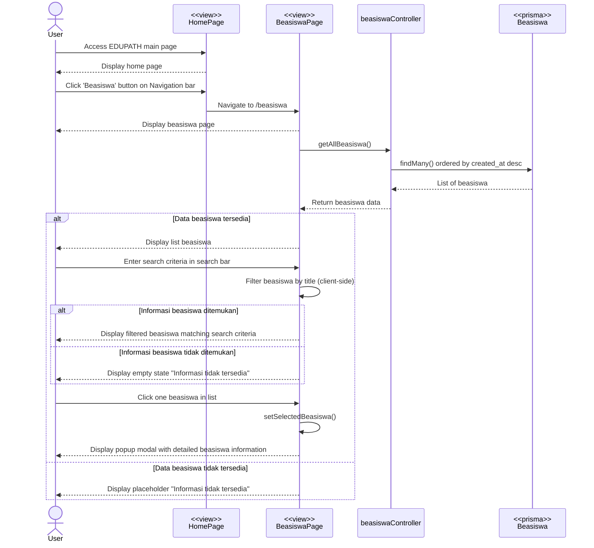

# Beasiswa Information Code Flow Documentation

## Overview

Dokumentasi ini menjelaskan alur lengkap untuk fitur **Melihat Informasi Beasiswa** di aplikasi Edupath, mencakup menampilkan daftar beasiswa, pencarian, dan melihat detail beasiswa.

---

## 1. Flow Summary

### Main Steps:

1. User membuka halaman Beasiswa
2. Sistem menampilkan semua beasiswa yang tersedia
3. User dapat mencari beasiswa berdasarkan judul (opsional)
4. User klik card beasiswa untuk melihat detail
5. Sistem menampilkan modal dengan informasi lengkap beasiswa
6. User dapat zoom image beasiswa
7. User dapat mengakses link eksternal beasiswa

### Special Features:

- **Real-time Search**: Filter beasiswa berdasarkan judul secara real-time
- **Image Zoom**: Zoom in/out untuk melihat poster beasiswa lebih jelas
- **External Link**: Direct link ke website beasiswa
- **Responsive Grid**: Card layout yang responsive (1-2-4 columns)
- **Empty State**: Informative empty state untuk no results
- **Date Formatting**: Format tanggal dalam Bahasa Indonesia

---

## 2. Sequence Diagram



---

## 3. Component Structure

### BeasiswaPage (`index.tsx`)

**State Management:**

```typescript
// Main data states
const [beasiswaList, setBeasiswaList] = useState<Beasiswa[]>([]);
const [filteredList, setFilteredList] = useState<Beasiswa[]>([]);
const [loading, setLoading] = useState(true);

// Search state
const [searchTerm, setSearchTerm] = useState("");

// Modal states
const [selectedBeasiswa, setSelectedBeasiswa] = useState<Beasiswa | null>(null);
const [isImageZoomed, setIsImageZoomed] = useState(false);
```

**Key Methods:**

- `fetchBeasiswa()`: Fetch semua beasiswa dari backend
- `handleSearchChange()`: Filter beasiswa berdasarkan search term (client-side)
- `handleCloseModal()`: Close detail modal dan reset zoom state
- `formatDate()`: Format tanggal ke format Indonesia

**useEffect Hooks:**

```typescript
// 1. Fetch beasiswa on mount
useEffect(() => {
  fetchBeasiswa();
}, []);

// 2. Filter beasiswa on search term change
useEffect(() => {
  if (searchTerm.trim() === "") {
    setFilteredList(beasiswaList);
  } else {
    const filtered = beasiswaList.filter((beasiswa) =>
      beasiswa.title.toLowerCase().includes(searchTerm.toLowerCase())
    );
    setFilteredList(filtered);
  }
}, [searchTerm, beasiswaList]);
```

### Child Components

**1. BeasiswaCard (`components/BeasiswaCard.tsx`)**

- Display beasiswa thumbnail
- Show title and date
- Click handler untuk open detail modal

**2. BeasiswaDetailModal (`components/BeasiswaDetailModal.tsx`)**

- Full beasiswa information
- Large image preview
- External link button
- Image zoom trigger
- Close button

**3. ImageZoomModal (`components/ImageZoomModal.tsx`)**

- Full-screen image viewer
- Zoom in/out controls
- Overlay with close button

---

## 4. Data Structure

### Beasiswa Interface

```typescript
interface Beasiswa {
  beasiswa_id: string; // UUID primary key
  title: string; // Beasiswa title/name
  image_url: string; // Cloudinary image URL
  link: string; // External beasiswa website
  created_at: string; // ISO datetime
  updated_at: string; // ISO datetime
}
```

---

## 5. API Specification

### Get All Beasiswa

**Endpoint:** `GET /api/beasiswa`

**Request:**

```http
GET /api/beasiswa
```

**Response Success:**

```json
{
  "success": true,
  "data": [
    {
      "beasiswa_id": "uuid",
      "title": "Beasiswa LPDP 2024",
      "image_url": "https://res.cloudinary.com/xxx/image.jpg",
      "link": "https://lpdp.kemenkeu.go.id",
      "created_at": "2024-01-15T10:30:00.000Z",
      "updated_at": "2024-01-15T10:30:00.000Z"
    },
    {
      "beasiswa_id": "uuid",
      "title": "Beasiswa Unggulan Kemendikbud",
      "image_url": "https://res.cloudinary.com/xxx/image2.jpg",
      "link": "https://beasiswaunggulan.kemdikbud.go.id",
      "created_at": "2024-01-14T09:00:00.000Z",
      "updated_at": "2024-01-14T09:00:00.000Z"
    }
  ]
}
```

**Response Error:**

```json
{
  "success": false,
  "message": "Failed to fetch beasiswa data",
  "error": "Error details"
}
```

---

## 6. Search & Filter Logic

### Client-Side Search

```typescript
// Real-time filtering on every keystroke
useEffect(() => {
  if (searchTerm.trim() === "") {
    // Show all beasiswa
    setFilteredList(beasiswaList);
  } else {
    // Filter by title (case-insensitive)
    const filtered = beasiswaList.filter((beasiswa) =>
      beasiswa.title.toLowerCase().includes(searchTerm.toLowerCase())
    );
    setFilteredList(filtered);
  }
}, [searchTerm, beasiswaList]);
```

**Search Features:**

- ✅ Case-insensitive search
- ✅ Real-time filtering (no submit button)
- ✅ Search by beasiswa title only
- ✅ Clear search button (X icon)
- ✅ Result count display

---

## 7. Modal Management

### Detail Modal Flow

```typescript
// Open modal
const handleCardClick = (beasiswa: Beasiswa) => {
  setSelectedBeasiswa(beasiswa);
  // Modal automatically opens when selectedBeasiswa is not null
};

// Close modal
const handleCloseModal = () => {
  setSelectedBeasiswa(null);
  setIsImageZoomed(false); // Reset zoom state
};
```

### Image Zoom Flow

```typescript
// Open zoom modal
const handleImageClick = () => {
  setIsImageZoomed(true);
};

// Close zoom modal
const handleZoomClose = () => {
  setIsImageZoomed(false);
};
```

---

## 8. User Experience Flow

### Happy Path - View All Beasiswa:

```
1. User masuk halaman Beasiswa ✅
2. API call ke /api/beasiswa ✅
3. Backend query all beasiswa (ordered by newest) ✅
4. Return beasiswa list ✅
5. Display beasiswa cards in grid (4 columns desktop) ✅
6. Show beasiswa count ✅
```

### Happy Path - Search Beasiswa:

```
1. User ketik "LPDP" di search bar ✅
2. Client-side filter triggered ✅
3. Filter beasiswa yang title mengandung "LPDP" ✅
4. Update filteredList state ✅
5. Display filtered results ✅
6. Show result count: "Ditemukan X beasiswa" ✅
```

### Happy Path - View Detail:

```
1. User klik beasiswa card ✅
2. setSelectedBeasiswa(beasiswa) ✅
3. Modal detail muncul ✅
4. Display: title, image, link, dates ✅
5. User klik image → Zoom modal muncul ✅
6. User klik "Kunjungi Link" → Open new tab ✅
7. User klik close → Modal tertutup ✅
```

### Error Path - No Results:

```
1. User search "zzzzz" ❌
2. Filter returns empty array ✅
3. Display EmptyState component ✅
4. Message: "Beasiswa tidak ditemukan" ✅
5. Suggestion: "Coba gunakan kata kunci lain" ✅
```

### Error Path - Network Error:

```
1. API call failed ❌
2. Catch error ✅
3. toast.error("Gagal mengambil data beasiswa") ✅
4. Display empty state atau error message ✅
```

---

## 9. Component Lifecycle

### On Mount

```typescript
useEffect(() => {
  fetchBeasiswa(); // Fetch all beasiswa
}, []);

const fetchBeasiswa = async () => {
  try {
    setLoading(true);
    const response = await axios.get(`${API_URL}/api/beasiswa`);
    setBeasiswaList(response.data.data);
    setFilteredList(response.data.data);
  } catch (error) {
    console.error("Error fetching beasiswa:", error);
    toast.error("Gagal mengambil data beasiswa");
  } finally {
    setLoading(false);
  }
};
```

### On Search Change

```typescript
useEffect(() => {
  // Filter beasiswa whenever searchTerm or beasiswaList changes
  if (searchTerm.trim() === "") {
    setFilteredList(beasiswaList);
  } else {
    const filtered = beasiswaList.filter((beasiswa) =>
      beasiswa.title.toLowerCase().includes(searchTerm.toLowerCase())
    );
    setFilteredList(filtered);
  }
}, [searchTerm, beasiswaList]);
```

---

## 10. UI Components Detail

### Hero Section

```typescript
<HeroSection
  backgroundImage={HeroSectionBG}
  title="Info Beasiswa"
  description={
    <>
      Temukan berbagai informasi beasiswa dari <br />
      universitas dan institusi pendidikan
    </>
  }
  icon={BeasiswaIcon}
>
  {/* Search Bar */}
  <input
    type="text"
    placeholder="Cari beasiswa..."
    value={searchTerm}
    onChange={(e) => setSearchTerm(e.target.value)}
  />
</HeroSection>
```

### Beasiswa Grid

```typescript
<div className="grid grid-cols-1 md:grid-cols-2 lg:grid-cols-4 gap-6">
  {filteredList.map((beasiswa) => (
    <BeasiswaCard
      key={beasiswa.beasiswa_id}
      beasiswa={beasiswa}
      onClick={() => setSelectedBeasiswa(beasiswa)}
      formatDate={formatDate}
    />
  ))}
</div>
```

### Empty State

```typescript
{
  filteredList.length === 0 && (
    <EmptyState
      icon={<Search size={64} />}
      title={
        searchTerm ? "Beasiswa tidak ditemukan" : "Belum ada info beasiswa"
      }
      description={
        searchTerm
          ? "Coba gunakan kata kunci lain"
          : "Guru BK belum menambahkan info beasiswa"
      }
    />
  );
}
```

---

## 11. Date Formatting

### Format Function

```typescript
const formatDate = (dateString: string) => {
  return new Date(dateString).toLocaleDateString("id-ID", {
    day: "numeric",
    month: "long",
    year: "numeric",
  });
};

// Output example: "15 Januari 2024"
```

---

## 12. External Link Handling

### Open Link in New Tab

```typescript
<a
  href={beasiswa.link}
  target="_blank"
  rel="noopener noreferrer"
  className="btn btn-primary"
>
  Kunjungi Link Beasiswa
</a>
```

**Security Notes:**

- `target="_blank"`: Opens in new tab
- `rel="noopener noreferrer"`: Prevents security vulnerabilities
  - `noopener`: Prevents new page from accessing `window.opener`
  - `noreferrer`: Prevents referrer header from being sent

---

## 13. Error Handling

### API Error

```typescript
try {
  const response = await axios.get(`${API_URL}/api/beasiswa`);
  setBeasiswaList(response.data.data);
  setFilteredList(response.data.data);
} catch (error) {
  console.error("Error fetching beasiswa:", error);
  toast.error("Gagal mengambil data beasiswa");
} finally {
  setLoading(false);
}
```

---

## 14. Integration Points

### Frontend → Backend:

- `GET /api/beasiswa`: Fetch all beasiswa data

### External Services:

- Cloudinary: Image hosting untuk beasiswa posters
- External beasiswa websites: Direct links dari link field

### Toast Notifications:

- Error: "Gagal mengambil data beasiswa"

---

## 15. Dependencies

### Frontend Libraries:

- `react`: Core framework
- `axios`: HTTP requests
- `react-hot-toast`: Toast notifications
- `lucide-react`: Icons (Search, X)

### Backend:

- `prisma`: ORM untuk database
- `express`: HTTP server

---

## 16. Database Schema

### Beasiswa Table

```prisma
model Beasiswa {
  beasiswa_id   String   @id @default(uuid())
  title         String
  image_url     String
  link          String
  created_at    DateTime @default(now())
  updated_at    DateTime @updatedAt
}
```

---

## 17. Responsive Design

### Grid Breakpoints

```typescript
grid - cols - 1; // Mobile: 1 column
md: grid - cols - 2; // Tablet: 2 columns
lg: grid - cols - 4; // Desktop: 4 columns
```

### Component Responsiveness

- Hero Section: Responsive height and padding
- Search Bar: Full width on mobile, max-width on desktop
- Cards: Stack on mobile, grid on larger screens
- Modals: Full screen on mobile, centered on desktop

---

## 18. Performance Considerations

### Client-Side Filtering

- ✅ **Pro**: Instant results (no API calls)
- ✅ **Pro**: Better UX for small datasets
- ⚠️ **Con**: All data loaded upfront
- 💡 **Best for**: < 100 beasiswa items

**Future Enhancement:**

```typescript
// If dataset grows large (> 100 items), consider:
// 1. Server-side search with debouncing
// 2. Pagination
// 3. Infinite scroll
```

---

## 19. State Management Summary

### BeasiswaPage States:

| State              | Type               | Purpose                       |
| ------------------ | ------------------ | ----------------------------- |
| `beasiswaList`     | `Beasiswa[]`       | Original full data from API   |
| `filteredList`     | `Beasiswa[]`       | Filtered results for display  |
| `loading`          | `boolean`          | Loading state during fetch    |
| `searchTerm`       | `string`           | Current search keyword        |
| `selectedBeasiswa` | `Beasiswa \| null` | Currently selected for detail |
| `isImageZoomed`    | `boolean`          | Image zoom modal state        |

---

## Conclusion

Flow ini mengimplementasikan **melihat informasi beasiswa** dengan:

- ✅ Simple and clean UI untuk browse beasiswa
- ✅ Real-time client-side search
- ✅ Detail modal dengan full information
- ✅ Image zoom capability
- ✅ External link integration
- ✅ Responsive grid layout
- ✅ Empty state handling
- ✅ Error handling dengan toast notifications

Sistem dirancang untuk memberikan user experience yang mudah dan cepat dalam menemukan informasi beasiswa yang relevan.
