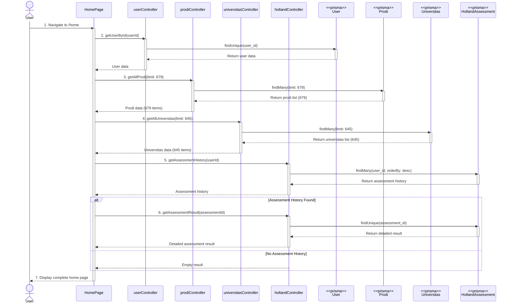

# HOME PAGE FLOW - Complete Documentation

## 📋 Overview

Dokumentasi lengkap alur halaman utama (Home) dari load awal sampai display semua data.

---

## 🎭 Mermaid Sequence Diagram



---

## 🎯 Flow Diagram Summary

```
User Navigate
    ↓
HomePage Component Mount
    ↓
4 Parallel useEffect Calls
    ↓
    ├── Fetch User Data (GET /api/users/:id)
    ├── Fetch Prodi Data (GET /api/prodi?limit=679)
    ├── Fetch Universitas Data (GET /api/universitas?limit=645)
    └── Fetch Holland Assessment (GET /api/holland/history)
            ↓
            └── If has history → GET /api/holland/result/:id
    ↓
Display Home Page Content:
    ├── Hero Section (User greeting)
    ├── Info Cards (6 cards)
    ├── Statistics Section
    │   ├── Total Prodi (679)
    │   ├── Total Universitas (645)
    │   └── Assessment Stats
    ├── Test History Slider
    └── Top Recommendations
```

---

## 📝 Detailed Step-by-Step Flow

### **STEP 1: User Navigate to Home**

**Route:** `/home`

**Component:** `client/src/pages/user/Home/index.tsx`

```typescript
// User sudah login, navigate ke /home
navigate("/home");
```

---

### **STEP 2: Component Mount & Initialize States**

**File:** `client/src/pages/user/Home/index.tsx`

```typescript
const Home = () => {
  const navigate = useNavigate();

  // User data state
  const [user, setUser] = useState<User | null>(null);

  // Prodi/Jurusan data state
  const [allMajors, setAllMajors] = useState<string[]>([]);
  const [majorsLoading, setMajorsLoading] = useState(true);

  // Universitas data state
  const [allUniversities, setAllUniversities] = useState<string[]>([]);
  const [universitiesLoading, setUniversitiesLoading] = useState(true);

  // Holland Assessment data state
  const [assessmentStats, setAssessmentStats] = useState({
    totalTests: 0,
    lastTestDate: null,
    topRecommendation: null,
    latestTestDetails: null,
    allTests: [],
  });
  const [assessmentLoading, setAssessmentLoading] = useState(true);
```

**Initial State:**

- `user`: null
- `allMajors`: []
- `allUniversities`: []
- `assessmentStats`: empty object
- All loading states: true

---

### **STEP 3: Parallel Data Fetching (4 useEffect)**

**All useEffect hooks run in parallel after component mount**

---

#### **3.1 Fetch User Data**

**API Endpoint:** `GET /api/users/:userId`

**Frontend Code:**

```typescript
useEffect(() => {
  const fetchUserData = async () => {
    try {
      const userData = await axios.get(
        `${API_URL}/api/users/${TokenManager.getUserData().userId}`,
        {
          headers: {
            Authorization: `Bearer ${TokenManager.getToken()}`,
          },
        }
      );
      setUser(userData.data.data);
    } catch (error) {
      console.error("Error fetching user data:", error);
    }
  };

  fetchUserData();
}, [navigate]);
```

**Request:**

```
GET /api/users/US001
Headers:
  Authorization: Bearer eyJhbGci...
```

**Backend Query:**

```typescript
const user = await prisma.user.findUnique({
  where: { user_id: userId },
});
```

**Response:**

```json
{
  "success": true,
  "data": {
    "user_id": "US001",
    "firstname": "John",
    "lastname": "Doe",
    "email": "john@example.com",
    "role": "STUDENT",
    "kelas": 12
  }
}
```

---

#### **3.2 Fetch Prodi Data**

**API Endpoint:** `GET /api/prodi?limit=679`

**Frontend Code:**

```typescript
useEffect(() => {
  const fetchProdiData = async () => {
    try {
      const token = TokenManager.getToken();
      const response = await axios.get(`${API_URL}/api/prodi?limit=679`, {
        headers: {
          Authorization: `Bearer ${token}`,
        },
      });

      const data = response.data.data || response.data;
      if (Array.isArray(data)) {
        const prodiNames = data.map((prodi: any) => prodi.nama_prodi);
        setAllMajors(prodiNames);
      }
    } catch (error) {
      console.error("Error fetching prodi data:", error);
      setAllMajors([]);
    } finally {
      setMajorsLoading(false);
    }
  };

  fetchProdiData();
}, []);
```

**Request:**

```
GET /api/prodi?limit=679
Headers:
  Authorization: Bearer eyJhbGci...
```

**Backend Query:**

```typescript
const prodis = await prisma.prodi.findMany({
  take: limit,
  select: {
    nama_prodi: true,
    jenjang: true,
    // ... other fields
  },
});
```

**Response:**

```json
{
  "success": true,
  "data": [
    { "nama_prodi": "Teknik Informatika", "jenjang": "S1" },
    { "nama_prodi": "Sistem Informasi", "jenjang": "S1" },
    ...679 items
  ],
  "count": 679
}
```

---

#### **3.3 Fetch Universitas Data**

**API Endpoint:** `GET /api/universitas?limit=645`

**Frontend Code:**

```typescript
useEffect(() => {
  const fetchUniversitasData = async () => {
    try {
      const token = TokenManager.getToken();
      const response = await axios.get(`${API_URL}/api/universitas?limit=645`, {
        headers: {
          Authorization: `Bearer ${token}`,
        },
      });

      const data = response.data.data || response.data;
      if (Array.isArray(data)) {
        const universitasNames = data.map((univ: any) => univ.nama);
        setAllUniversities(universitasNames);
      }
    } catch (error) {
      console.error("Error fetching universitas data:", error);
      setAllUniversities([]);
    } finally {
      setUniversitiesLoading(false);
    }
  };

  fetchUniversitasData();
}, []);
```

**Request:**

```
GET /api/universitas?limit=645
Headers:
  Authorization: Bearer eyJhbGci...
```

**Backend Query:**

```typescript
const universitas = await prisma.universitas.findMany({
  take: limit,
  select: {
    nama: true,
    akreditasi: true,
    // ... other fields
  },
});
```

**Response:**

```json
{
  "success": true,
  "data": [
    { "nama": "Universitas Indonesia", "akreditasi": "A" },
    { "nama": "Institut Teknologi Bandung", "akreditasi": "A" },
    ...645 items
  ],
  "count": 645
}
```

---

#### **3.4 Fetch Holland Assessment Data**

**API Endpoint (Step 1):** `GET /api/holland/history`

**Frontend Code:**

```typescript
useEffect(() => {
  const fetchAssessmentData = async () => {
    try {
      const token = TokenManager.getToken();
      const response = await axios.get(`${API_URL}/api/holland/history`, {
        headers: {
          Authorization: `Bearer ${token}`,
        },
      });
      const assessments = response.data.data;
      const totalTests = assessments.length;

      if (totalTests > 0) {
        const latestAssessment = assessments[0]; // Most recent

        // Fetch detailed result for latest assessment
        const detailResponse = await axios.get(
          `${API_URL}/api/holland/result/${latestAssessment.assessment_id}`,
          {
            headers: {
              Authorization: `Bearer ${token}`,
            },
          }
        );
        const result = detailResponse.data.data;

        setAssessmentStats({
          totalTests,
          lastTestDate: new Date(
            latestAssessment.completed_at
          ).toLocaleDateString(),
          topRecommendation: {
            major: result.recommendations[0].nama_prodi,
            percentage: Math.round(result.recommendations[0].match_percentage),
          },
          latestTestDetails: {
            scores: result.scores,
            recommendations: result.recommendations.slice(0, 5),
            completed_at: latestAssessment.completed_at,
          },
          allTests: assessments.map((a) => ({
            assessment_id: a.assessment_id,
            completed_at: a.completed_at,
            dominant_type: `${a.primary_type} + ${a.secondary_type}`,
          })),
        });
      }
    } catch (error) {
      console.error("Error fetching assessment data:", error);
    } finally {
      setAssessmentLoading(false);
    }
  };

  fetchAssessmentData();
}, []);
```

**Request 1:**

```
GET /api/holland/history
Headers:
  Authorization: Bearer eyJhbGci...
```

**Backend Query 1:**

```typescript
const assessments = await prisma.hollandAssessment.findMany({
  where: { user_id: userId },
  orderBy: { completed_at: "desc" },
});
```

**Response 1:**

```json
{
  "success": true,
  "data": [
    {
      "assessment_id": "HASS001",
      "completed_at": "2025-12-08T10:00:00Z",
      "primary_type": "Realistic",
      "secondary_type": "Investigative",
      "holland_code": "RI"
    }
  ]
}
```

**Request 2 (if has history):**

```
GET /api/holland/result/HASS001
Headers:
  Authorization: Bearer eyJhbGci...
```

**Backend Query 2:**

```typescript
const result = await prisma.hollandAssessment.findUnique({
  where: { assessment_id: assessmentId },
  include: {
    recommendations: true,
    answers: true,
  },
});
```

**Response 2:**

```json
{
  "success": true,
  "data": {
    "scores": {
      "realistic": 85,
      "investigative": 78,
      "artistic": 45,
      "social": 52,
      "enterprising": 38,
      "conventional": 60
    },
    "recommendations": [
      {
        "nama_prodi": "Teknik Informatika",
        "match_percentage": 92.5,
        "jenjang": "S1"
      },
      {
        "nama_prodi": "Teknik Elektro",
        "match_percentage": 88.3,
        "jenjang": "S1"
      }
    ]
  }
}
```

---

### **STEP 4: Display Home Page Content**

**After all data loaded, HomePage renders:**

#### **4.1 Hero Section**

```tsx
<div className="bg-primary text-white p-8 rounded-xl">
  <h1>Selamat datang, {user?.firstname}!</h1>
  <p>Mulai jelajahi universitas dan jurusan impianmu</p>
</div>
```

#### **4.2 Info Cards (6 Cards)**

```tsx
<div className="grid grid-cols-2 md:grid-cols-3 gap-4">
  <InfoCard icon={infoHome1} title="Tes Minat" link="/tes" />
  <InfoCard icon={infoHome2} title="Jurusan" link="/jurusan" />
  <InfoCard icon={infoHome3} title="Universitas" link="/universitas" />
  <InfoCard icon={infoHome4} title="Konseling" link="/konseling" />
  <InfoCard icon={infoHome5} title="Beasiswa" link="/beasiswa" />
  <InfoCard icon={infoHome6} title="Profil" link="/profil" />
</div>
```

#### **4.3 Statistics Section**

```tsx
<div className="grid grid-cols-1 md:grid-cols-3 gap-6">
  {/* Total Prodi */}
  <StatCard
    title="Total Jurusan"
    value={majorsLoading ? "..." : allMajors.length}
    subtitle="Program Studi Tersedia"
  />

  {/* Total Universitas */}
  <StatCard
    title="Total Universitas"
    value={universitiesLoading ? "..." : allUniversities.length}
    subtitle="Perguruan Tinggi"
  />

  {/* Assessment Stats */}
  <StatCard
    title="Tes Minat"
    value={assessmentStats.totalTests}
    subtitle={
      assessmentStats.lastTestDate
        ? `Terakhir: ${assessmentStats.lastTestDate}`
        : "Belum ada tes"
    }
  />
</div>
```

#### **4.4 Test History Slider**

```tsx
{
  assessmentStats.allTests.length > 0 && (
    <div className="overflow-x-auto">
      {assessmentStats.allTests.map((test) => (
        <TestHistoryCard
          key={test.assessment_id}
          date={test.completed_at}
          type={test.dominant_type}
        />
      ))}
    </div>
  );
}
```

#### **4.5 Top Recommendations**

```tsx
{
  assessmentStats.topRecommendation && (
    <div className="bg-white p-6 rounded-xl shadow">
      <h3>Rekomendasi Teratas</h3>
      <p className="text-2xl font-bold">
        {assessmentStats.topRecommendation.major}
      </p>
      <p className="text-green-600">
        {assessmentStats.topRecommendation.percentage}% Match
      </p>
    </div>
  );
}
```

---

## 🔑 Key Components

### **Frontend:**

1. **Home/index.tsx** - Main home page component
2. **SectionCard.tsx** - Reusable card untuk info sections
3. **UnivAndProdiTag.tsx** - Tag component untuk display universitas/prodi
4. **TokenManager.ts** - JWT token & auth management

### **Backend:**

1. **userController.ts** - Handle GET /api/users/:id
2. **prodiController.ts** - Handle GET /api/prodi
3. **universitasController.ts** - Handle GET /api/universitas
4. **hollandController.ts** - Handle GET /api/holland/history & /result/:id

### **Database:**

1. **User** - Table untuk user data
2. **Prodi** - Table untuk program studi (679 records)
3. **Universitas** - Table untuk perguruan tinggi (645 records)
4. **HollandAssessment** - Table untuk tes minat Holland

---

## 📊 Data Flow Diagram

```
┌─────────────┐
│   USER      │
│  (Browser)  │
└──────┬──────┘
       │ Navigate to /home
       ↓
┌──────────────────────┐
│   HomePage Mount     │
│  - Initialize states │
└──────┬───────────────┘
       │ 4 Parallel useEffect
       ↓
┌──────────────────────────────────────────────┐
│         Parallel Data Fetching               │
├──────────────┬──────────────┬────────────────┤
│ GET /users   │ GET /prodi   │ GET /universitas│
└──────┬───────┴──────┬───────┴────────┬───────┘
       │              │                │
       ↓              ↓                ↓
┌──────────────┐ ┌──────────────┐ ┌──────────────┐
│   UserDB     │ │   ProdiDB    │ │   UnivDB     │
└──────┬───────┘ └──────┬───────┘ └──────┬───────┘
       │              │                │
       └──────────────┴────────────────┘
                      ↓
       ┌─────────────────────────────┐
       │ GET /holland/history        │
       └──────┬──────────────────────┘
              │
              ↓
       ┌──────────────────────────┐
       │   HollandDB              │
       └──────┬───────────────────┘
              │ If has history
              ↓
       ┌──────────────────────────┐
       │ GET /holland/result/:id  │
       └──────┬───────────────────┘
              │
              ↓
       ┌──────────────────────────┐
       │  Return detailed result  │
       └──────┬───────────────────┘
              │
              ↓
┌──────────────────────────────────────────┐
│      Update All States                   │
│  - setUser()                             │
│  - setAllMajors()                        │
│  - setAllUniversities()                  │
│  - setAssessmentStats()                  │
└──────┬───────────────────────────────────┘
       │
       ↓
┌──────────────────────────────────────────┐
│      Render Home Page                    │
│  - Hero Section                          │
│  - Info Cards (6)                        │
│  - Statistics (3 cards)                  │
│  - Test History Slider                   │
│  - Top Recommendations                   │
└──────────────────────────────────────────┘
```

---

## 📝 Notes

- **Parallel Loading:** 4 API calls berjalan bersamaan untuk performance
- **Loading States:** Setiap section punya loading indicator
- **Error Handling:** Fallback ke empty array/null jika API error
- **Token Required:** Semua API call butuh JWT token
- **Responsive Design:** Layout adapt untuk mobile & desktop
- **Data Persistence:** Data di-cache di state, tidak refetch saat rerender
- **Assessment Logic:** Hanya fetch detail jika ada history
- **Statistics:** Real-time count dari database (679 prodi, 645 universitas)

---

## 🎬 Complete Timeline

1. **T+0ms** - User navigate to /home
2. **T+10ms** - Component mount, initialize states
3. **T+20ms** - 4 useEffect start parallel
4. **T+150ms** - Backend receives 4 requests
5. **T+200ms** - User data returned
6. **T+250ms** - Prodi data returned (679 items)
7. **T+280ms** - Universitas data returned (645 items)
8. **T+300ms** - Holland history returned
9. **T+350ms** - Holland detail returned (if has history)
10. **T+400ms** - All states updated
11. **T+450ms** - Home page fully rendered

**Total Time:** ~450ms (with parallel loading)
