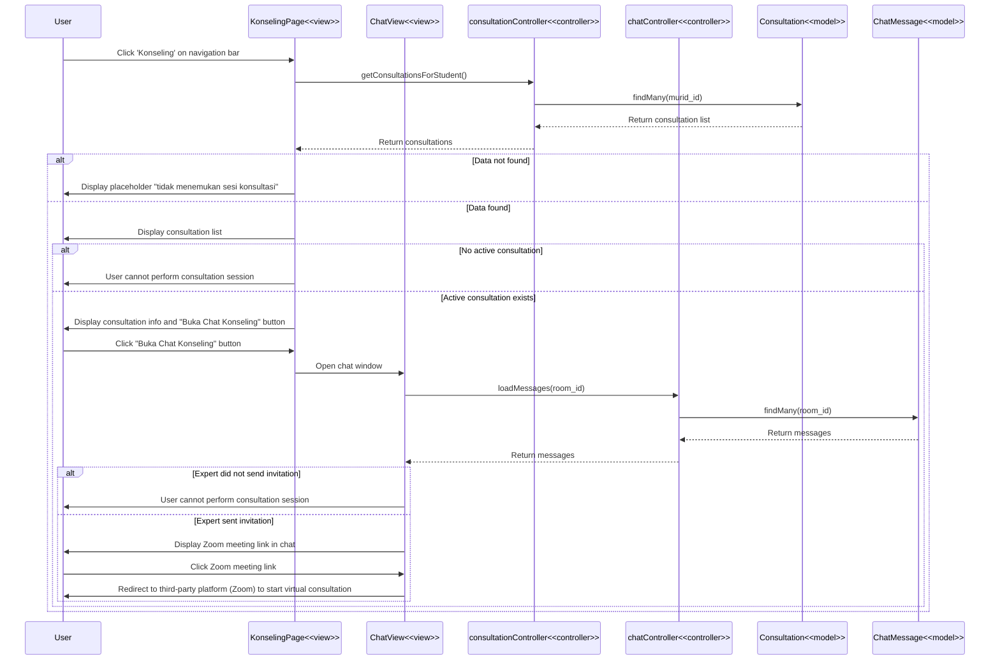

# Konsultasi Virtual dengan Ahli - Code Flow Documentation

## Overview

This document describes the code flow for the "Konsultasi Virtual dengan Ahli" (Virtual Consultation with Experts) feature. The flow allows admin/counselors to create Zoom meetings for virtual consultations with students, and students can join the virtual meetings through the provided links.

## Activity Diagram Flow

1. Admin accesses EDUPATH admin page → System displays admin dashboard
2. Admin clicks 'Kelola Live Chat' → System displays chat management page
3. Admin selects student with active consultation → System displays chat window
4. Admin clicks 'Create Zoom Meeting' button → System displays Zoom meeting creation form
5. Admin fills meeting details (topic, description) → Admin clicks 'Buat Meeting' button
6. System validates meeting data
7. **[Data valid]** → System creates Zoom meeting via Zoom API
8. **[Data invalid]** → System displays error message "Data tidak valid"
9. **[Zoom meeting successfully created]** → System saves meeting data to database → System sends Zoom link to student via chat → System displays notification to student → System displays success message to admin
10. **[Zoom meeting creation failed]** → System displays error message "Gagal membuat Zoom meeting"
11. Student receives notification → Student clicks notification
12. System displays consultation chat with Zoom meeting link
13. Student clicks 'Join Zoom Meeting' button → System opens Zoom meeting in new tab

## Technical Stack

- **Frontend**: React + TypeScript, React Router, Axios
- **Backend**: Express.js, Prisma ORM, Zoom API SDK
- **Database**: PostgreSQL
- **Video Conference**: Zoom API (Server-to-Server OAuth)
- **Notifications**: Real-time notifications system

## Architecture Components

### Frontend Pages

1. **Kelola Live Chat Page** (`client/src/pages/admin/kelolaLiveChat/KelolaLiveChat.tsx`)

   - Display student list with active consultations
   - Show chat interface
   - Handle Zoom meeting creation
   - Send Zoom link via chat

2. **ZoomRequestModal Component** (`client/src/pages/admin/kelolaLiveChat/components/ZoomRequestModal.tsx`)

   - Display Zoom meeting creation form
   - Validate meeting details
   - Submit meeting data

3. **ChatView Component** (`client/src/pages/user/Konseling/components/ChatView.tsx`)
   - Display chat messages
   - Render Zoom meeting link with special styling
   - Handle 'Join Zoom Meeting' button click

### Backend Components

1. **Zoom Controller** (`server/src/controllers/zoomController.ts`)

   - `createZoomMeeting()` - Create Zoom meeting via API
   - `getZoomMeetings()` - Get meetings for consultation
   - `deleteZoomMeeting()` - Cancel Zoom meeting

2. **Zoom Service** (`server/src/services/zoomService.ts`)
   - `getAccessToken()` - Authenticate with Zoom API
   - `createMeeting()` - Create meeting via Zoom API
   - `isConfigured()` - Check if Zoom credentials configured

### Database Models

- **ZoomMeeting** - Zoom meeting records
- **Consultation** - Consultation sessions
- **Notification** - Student notifications
- **ChatMessage** - Chat messages with Zoom links

## Sequence Diagram



## Data Flow Details

### 1. Create Zoom Meeting

**Frontend - Admin**:

```typescript
const handleZoomRequest = async (data: ZoomRequestData) => {
  const now = new Date();
  const scheduledDate = now.toISOString().split("T")[0];
  const scheduledTime = now.toTimeString().slice(0, 5);

  const zoomData = await chatHandler.createZoomMeeting({
    consultationId: selectedUser.consultation_id,
    userId: selectedUser.user_id,
    topic: data.topic,
    scheduledDate: scheduledDate,
    scheduledTime: scheduledTime,
    description: data.description,
  });

  if (zoomData) {
    const zoomMessage = `🎥 Zoom Meeting Dibuat\n━━━━━━━━━━━━━━━━━━━\n📋 ${data.topic}\n🔗 ${zoomData.joinUrl}\n🔗HOST ${zoomData.startUrl}\n🔑 ID: ${zoomData.zoomMeetingId}\n🔐 Pass: ${zoomData.password}`;
    await chatHandler.sendMessage(selectedUser.room_id, zoomMessage);
  }
};
```

**Backend**:

```typescript
async createZoomMeeting(req: Request, res: Response) {
  const { consultationId, userId, topic, scheduledDate, scheduledTime, description } = req.body;

  // Verify consultation exists
  const consultation = await prisma.consultation.findUnique({
    where: { consultation_id: consultationId },
  });

  // Get user info
  const user = await prisma.user.findUnique({
    where: { user_id: userId },
  });

  const scheduledDateTime = new Date(`${scheduledDate}T${scheduledTime}`);

  // Create Zoom meeting via API
  if (zoomService.isConfigured()) {
    const zoomMeeting = await zoomService.createMeeting({
      topic: topic,
      start_time: scheduledDateTime.toISOString(),
      duration: 60,
      timezone: "Asia/Jakarta",
      agenda: description,
    });

    meetingId = zoomMeeting.id.toString();
    joinUrl = zoomMeeting.join_url;
    startUrl = zoomMeeting.start_url;
  }

  // Save to database
  const dbZoomMeeting = await prisma.zoomMeeting.create({
    data: {
      meeting_id: meetingId,
      consultation_id: consultationId,
      host_id: adminId,
      topic: topic,
      scheduled_time: scheduledDateTime,
      join_url: joinUrl,
      start_url: startUrl,
    },
  });

  // Create notification
  await prisma.notification.create({
    data: {
      user_id: userId,
      type: "zoom_meeting",
      title: "Zoom Meeting Dibuat",
      message: `Admin telah membuat Zoom meeting: ${topic}`,
      link: joinUrl,
    },
  });

  return res.status(201).json({ success: true, data: dbZoomMeeting });
}
```

### 2. Zoom API Authentication

**Zoom Service**:

```typescript
private async getAccessToken(): Promise<string> {
  // Return cached token if valid
  if (this.accessToken && Date.now() < this.tokenExpiry) {
    return this.accessToken;
  }

  const credentials = Buffer.from(
    `${this.clientId}:${this.clientSecret}`
  ).toString("base64");

  const response = await axios.post(
    `https://zoom.us/oauth/token?grant_type=account_credentials&account_id=${this.accountId}`,
    {},
    {
      headers: {
        Authorization: `Basic ${credentials}`,
        "Content-Type": "application/x-www-form-urlencoded",
      },
    }
  );

  this.accessToken = response.data.access_token;
  this.tokenExpiry = Date.now() + (response.data.expires_in - 300) * 1000;

  return this.accessToken;
}
```

### 3. Create Meeting via Zoom API

**Zoom Service**:

```typescript
async createMeeting(config: ZoomMeetingConfig): Promise<ZoomMeetingResponse> {
  const token = await this.getAccessToken();

  const meetingData = {
    topic: config.topic,
    type: 2, // Scheduled meeting
    start_time: config.start_time,
    duration: config.duration,
    timezone: config.timezone,
    settings: {
      host_video: true,
      participant_video: true,
      waiting_room: true,
    },
  };

  const response = await axios.post(
    `https://api.zoom.us/v2/users/me/meetings`,
    meetingData,
    {
      headers: {
        Authorization: `Bearer ${token}`,
        "Content-Type": "application/json",
      },
    }
  );

  return {
    id: response.data.id,
    join_url: response.data.join_url,
    start_url: response.data.start_url,
    password: response.data.password,
  };
}
```

### 4. Display Zoom Link in Chat

**Frontend - Student**:

```typescript
// Check if message is Zoom meeting
const isZoomMessage = textMessage.includes("Zoom Meeting Dibuat");

if (isZoomMessage) {
  // Parse meeting details and display special UI
  const url = line.replace("🔗 ", "").trim();

  return (
    <a href={url} target="_blank" rel="noopener noreferrer">
      <button className="w-full bg-primary hover:bg-primary-hover text-white font-semibold py-3 px-4 rounded-lg">
        <svg className="w-5 h-5">
          <path d="M15 10l4.553-2.276A1 1 0 0121 8.618v6.764..." />
        </svg>
        Join Zoom Meeting
      </button>
    </a>
  );
}
```

## Data Structures

### ZoomMeeting

```typescript
interface ZoomMeeting {
  zoom_meeting_id: string;
  meeting_id: string;
  consultation_id: string;
  host_id: string;
  topic: string;
  scheduled_time: string;
  description?: string;
  meeting_password: string;
  join_url: string;
  start_url: string;
  status: string;
  created_at: string;
}
```

### ZoomMeetingConfig

```typescript
interface ZoomMeetingConfig {
  topic: string;
  start_time: string; // ISO 8601
  duration: number; // minutes
  timezone: string;
  password?: string;
  agenda?: string;
}
```

### ZoomRequestData

```typescript
interface ZoomRequestData {
  topic: string;
  description: string;
}
```

## API Endpoints

### POST `/api/zoom/create-meeting`

**Purpose**: Create Zoom meeting for consultation

**Authorization**: JWT token required (Admin only)

**Request Body**:

```json
{
  "consultationId": "CS001",
  "userId": "user123",
  "topic": "Konsultasi Pemilihan Jurusan",
  "scheduledDate": "2024-01-20",
  "scheduledTime": "14:00",
  "description": "Diskusi tentang minat dan bakat siswa"
}
```

**Response Success (201)**:

```json
{
  "success": true,
  "message": "Zoom meeting berhasil dibuat",
  "data": {
    "meetingId": "ZOOM-001",
    "zoomMeetingId": "1234567890",
    "topic": "Konsultasi Pemilihan Jurusan",
    "joinUrl": "https://zoom.us/j/1234567890?pwd=abc123",
    "startUrl": "https://zoom.us/s/1234567890?pwd=abc123",
    "password": "abc123",
    "status": "scheduled",
    "isRealZoom": true
  }
}
```

**Response Error (400)**:

```json
{
  "success": false,
  "message": "Missing required fields"
}
```

**Response Error (500)**:

```json
{
  "success": false,
  "message": "Gagal membuat Zoom meeting"
}
```

### GET `/api/zoom/meetings/:consultationId`

**Purpose**: Get all Zoom meetings for a consultation

**Authorization**: JWT token required

**Response Success (200)**:

```json
{
  "success": true,
  "message": "Berhasil mengambil data Zoom meetings",
  "data": [
    {
      "zoom_meeting_id": "ZOOM-001",
      "meeting_id": "1234567890",
      "topic": "Konsultasi Pemilihan Jurusan",
      "scheduled_time": "2024-01-20T14:00:00.000Z",
      "join_url": "https://zoom.us/j/1234567890?pwd=abc123",
      "status": "scheduled"
    }
  ]
}
```

### DELETE `/api/zoom/meeting/:meetingId`

**Purpose**: Cancel/delete Zoom meeting

**Authorization**: JWT token required (Admin only)

**Response Success (200)**:

```json
{
  "success": true,
  "message": "Zoom meeting berhasil dihapus"
}
```

## Key Features

### 1. Zoom API Integration

**Features**:

- Server-to-Server OAuth authentication
- Automatic token refresh
- Meeting creation with customizable settings
- Fallback to placeholder if Zoom not configured

**Configuration**:

```env
ZOOM_ACCOUNT_ID=your_account_id
ZOOM_CLIENT_ID=your_client_id
ZOOM_CLIENT_SECRET=your_client_secret
```

### 2. Real-time Notification

**Features**:

- Instant notification to student when meeting created
- Notification includes meeting topic and join link
- Clickable notification redirects to chat

**Implementation**:

```typescript
await prisma.notification.create({
  data: {
    user_id: userId,
    type: "zoom_meeting",
    title: "Zoom Meeting Dibuat",
    message: `Admin telah membuat Zoom meeting: ${topic}`,
    link: joinUrl,
  },
});
```

### 3. Special Zoom Message Styling

**Features**:

- Distinct visual styling for Zoom messages
- Video icon and formatted details
- Prominent 'Join Zoom Meeting' button
- Admin-only HOST URL (hidden from student)

**Detection**:

```typescript
const isZoomMessage = textMessage.includes("Zoom Meeting Dibuat");
```

### 4. Fallback Mechanism

**Features**:

- Generate placeholder meeting if Zoom API fails
- Continue workflow even without Zoom credentials
- Clear indication of real vs placeholder meetings

**Implementation**:

```typescript
if (zoomService.isConfigured()) {
  // Try real Zoom API
  try {
    const zoomMeeting = await zoomService.createMeeting(config);
  } catch (error) {
    // Fallback to placeholder
    meetingId = generateZoomMeetingId();
    joinUrl = `https://zoom.us/j/${meetingId}`;
  }
} else {
  // Use placeholder
  meetingId = generateZoomMeetingId();
}
```

## User Experience Flow

1. **Admin Workflow**:

   - Access Kelola Live Chat page
   - Select student with active consultation
   - Click 'Create Zoom Meeting' button
   - Fill meeting topic and description
   - Submit form
   - Receive success confirmation
   - Zoom link automatically sent to chat

2. **Student Workflow**:
   - Receive notification about new Zoom meeting
   - Click notification to open chat
   - See Zoom meeting details with special styling
   - Click 'Join Zoom Meeting' button
   - Zoom opens in new tab
   - Join virtual consultation session

## Error States

### Invalid Meeting Data

- **Condition**: Missing required fields (topic, consultationId, etc.)
- **Message**: "Data tidak valid" or "Missing required fields"
- **Action**: Display validation errors in form

### Zoom API Authentication Failed

- **Condition**: Invalid credentials or expired token
- **Message**: "Failed to authenticate with Zoom API"
- **Action**: Fall back to placeholder meeting

### Meeting Creation Failed

- **Condition**: Zoom API returns error
- **Message**: "Gagal membuat Zoom meeting"
- **Action**: Display error toast, retry option

### Consultation Not Found

- **Condition**: Invalid consultationId
- **Message**: "Consultation not found or unauthorized"
- **Action**: Display error, prevent meeting creation

## Performance Optimizations

1. **Token Caching**: Cache OAuth token until expiry to reduce API calls
2. **Automatic Refresh**: Refresh token 5 minutes before expiry
3. **Fallback Strategy**: Continue workflow even if Zoom unavailable
4. **Validation**: Validate data before API calls to prevent unnecessary requests
5. **Error Handling**: Graceful degradation with placeholder meetings

## Database Queries

### Create Zoom Meeting

```typescript
const dbZoomMeeting = await prisma.zoomMeeting.create({
  data: {
    meeting_id: meetingId,
    consultation_id: consultationId,
    host_id: adminId,
    topic: topic,
    scheduled_time: scheduledDateTime,
    description: description,
    meeting_password: meetingPassword,
    join_url: joinUrl,
    start_url: startUrl,
  },
});
```

### Get Meetings for Consultation

```typescript
const meetings = await prisma.zoomMeeting.findMany({
  where: {
    consultation_id: consultationId,
  },
  orderBy: {
    scheduled_time: "desc",
  },
});
```

### Delete Zoom Meeting

```typescript
await prisma.zoomMeeting.update({
  where: { zoom_meeting_id: meetingId },
  data: { status: "cancelled" },
});
```

## Security Considerations

1. **Authentication**: Only authenticated admins can create meetings
2. **Authorization**: Verify admin owns the consultation
3. **Token Security**: Store Zoom credentials in environment variables
4. **URL Validation**: Validate meeting URLs before displaying
5. **Data Encryption**: Sensitive meeting data encrypted in database

---

**Last Updated**: 2024-01-15  
**Version**: 1.0  
**Related Diagrams**: Activity Diagram - Konsultasi Virtual dengan Ahli  
**Related Documentation**: LIHAT_KONSULTASI_DAN_CHAT_CODE_FLOW.md, MEMBUAT_JADWAL_KONSULTASI_CODE_FLOW.md
