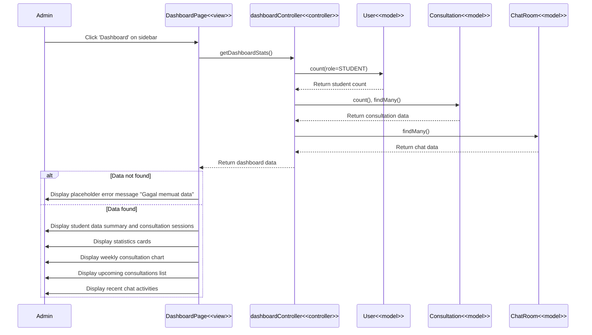

# Lihat Dashboard Admin - Code Flow Documentation

## Overview

This document describes the code flow for the "Lihat Dashboard Admin" (View Admin Dashboard) feature. The flow allows admin/counselors to view comprehensive dashboard statistics including student data, consultation summaries, and system analytics.

## Activity Diagram Flow

1. Admin logs in with admin credentials → System displays special page for admin
2. Admin selects 'Dashboard' option via sidebar → System displays Admin Dashboard page
3. System retrieves dashboard summary data from database
4. **[Data found]** → System displays student data summary and consultation sessions stored in system
5. **[Data not found]** → System displays placeholder error message for failed data loading

## Technical Stack

- **Frontend**: React + TypeScript, React Router, Axios, Chart.js
- **Backend**: Express.js, Prisma ORM
- **Database**: PostgreSQL
- **Charts**: Chart.js with react-chartjs-2
- **Auto-refresh**: 30-second polling interval

## Architecture Components

### Frontend Pages

1. **Admin Dashboard Page** (`client/src/pages/admin/Dashboard/index.tsx`)
   - Display dashboard statistics cards
   - Render weekly consultation charts
   - Show upcoming consultations list
   - Display recent chat activities
   - Auto-refresh data every 30 seconds

### Backend Components

1. **Dashboard Controller** (`server/src/controllers/dashboardController.ts`)
   - `getDashboardStats()` - Get comprehensive dashboard statistics
   - `getUpcomingConsultations()` - Get scheduled consultations
   - `getRecentChats()` - Get recent chat activities
   - `getWeeklyConsultations()` - Get weekly consultation data
   - `autoCompleteExpiredConsultations()` - Auto-complete expired sessions

### Database Models

- **User** - Student and admin users
- **Consultation** - Consultation sessions
- **ChatRoom** - Chat room records
- **ChatMessage** - Chat messages
- **HollandAssessment** - Career assessment records

## Sequence Diagram



## Data Flow Details

### 1. Fetch Dashboard Statistics

**Frontend**:

```typescript
const fetchDashboardData = async () => {
  try {
    setLoading(true);

    const token = TokenManager.getToken();
    const authHeader = {
      headers: {
        Authorization: `Bearer ${token}`,
        "Content-Type": "application/json",
      },
    };

    // Fetch all data in parallel for faster loading
    const [statsResponse, consultationsResponse, chatsResponse] =
      await Promise.all([
        axios.get(`${API_URL}/api/admin/dashboard/stats`, authHeader),
        axios.get(
          `${API_URL}/api/admin/dashboard/upcoming-consultations`,
          authHeader
        ),
        axios.get(`${API_URL}/api/admin/dashboard/recent-chats`, authHeader),
      ]);

    if (statsResponse.data.success) {
      const dashboardData = statsResponse.data.data;
      setStats(dashboardData.stats);
      setWeeklyData(dashboardData.weeklyConsultations.data);
    }
    if (consultationsResponse.data.success) {
      setUpcomingConsultations(consultationsResponse.data.data);
    }
    if (chatsResponse.data.success) {
      setRecentChats(chatsResponse.data.data);
    }
  } catch (error) {
    console.error("Error fetching dashboard data:", error);
  } finally {
    setLoading(false);
  }
};
```

**Backend**:

```typescript
export const getDashboardStats = async (req: Request, res: Response) => {
  try {
    const adminId = req.user?.user_id;

    // Run all counts in parallel for faster response
    const [
      totalStudents,
      totalConsultations,
      pendingConsultations,
      activeConsultations,
      completedConsultations,
      declinedConsultations,
      totalChats,
    ] = await Promise.all([
      prisma.user.count({ where: { role: "STUDENT" } }),
      prisma.consultation.count({ where: { admin_id: adminId } }),
      prisma.consultation.count({
        where: { status: "PENDING", admin_id: adminId },
      }),
      prisma.consultation.count({
        where: { status: "ACCEPTED", admin_id: adminId },
      }),
      prisma.consultation.count({
        where: { status: "COMPLETED", admin_id: adminId },
      }),
      prisma.consultation.count({
        where: { status: "DECLINED", admin_id: adminId },
      }),
      prisma.chatRoom.count({ where: { admin_id: adminId } }),
    ]);

    // Count unread chats
    const chatRooms = await prisma.chatRoom.findMany({
      where: { admin_id: adminId },
      include: {
        messages: {
          where: { is_read: false },
        },
      },
    });

    const unreadChats = chatRooms.filter((room) =>
      room.messages.some((msg: any) => msg.sender_id === room.murid_id)
    ).length;

    const data = {
      stats: {
        totalStudents,
        totalConsultations,
        pendingConsultations,
        activeConsultations,
        completedConsultations,
        totalChats,
        unreadChats,
      },
      weeklyConsultations: {
        labels: ["Min", "Sen", "Sel", "Rab", "Kam", "Jum", "Sab"],
        data: weeklyData,
      },
    };

    return res.status(200).json({
      success: true,
      data,
    });
  } catch (error) {
    console.error("Error fetching dashboard stats:", error);
    return res.status(500).json({
      success: false,
      message: "Gagal mengambil statistik dashboard",
    });
  }
};
```

### 2. Auto-Refresh Mechanism

**Frontend**:

```typescript
useEffect(() => {
  fetchDashboardData();

  // Auto-refresh dashboard data every 30 seconds
  const refreshInterval = setInterval(() => {
    fetchDashboardData();
  }, 30000);

  return () => clearInterval(refreshInterval);
}, []);
```

### 3. Weekly Consultation Chart

**Frontend**:

```typescript
const weeklyConsultationsData = {
  labels: ["Min", "Sen", "Sel", "Rab", "Kam", "Jum", "Sab"],
  datasets: [
    {
      label: "Konsultasi",
      data: weeklyData,
      backgroundColor: "#6CCBFF",
      borderWidth: 0.5,
    },
  ],
};
```

**Backend - Calculate Weekly Data**:

```typescript
// Get weekly consultations (last 7 days)
const now = new Date();
const today = new Date(
  now.toLocaleString("en-US", { timeZone: "Asia/Jakarta" })
);
const sevenDaysAgo = new Date(today);
sevenDaysAgo.setDate(today.getDate() - 6);

const weeklyConsultations = await prisma.consultation.findMany({
  where: {
    admin_id: adminId,
    consultation_date: {
      gte: sevenDaysAgo,
      lte: today,
    },
  },
  select: {
    consultation_date: true,
  },
});

// Group by day
const weeklyData = Array(7).fill(0);
weeklyConsultations.forEach((consultation) => {
  const date = new Date(consultation.consultation_date);
  const dayIndex = date.getDay();
  weeklyData[dayIndex]++;
});
```

## Data Structures

### DashboardStats

```typescript
interface DashboardStats {
  totalStudents: number;
  totalConsultations: number;
  pendingConsultations: number;
  activeConsultations: number;
  completedConsultations: number;
  totalChats: number;
  unreadChats: number;
}
```

### UpcomingConsultation

```typescript
interface UpcomingConsultation {
  consultation_id: string;
  murid_name: string;
  topic: string;
  consultation_date: string;
  status: string;
}
```

### RecentChat

```typescript
interface RecentChat {
  room_id: string;
  user_id: string;
  murid_name: string;
  last_message: string;
  last_message_time: string;
  unread_count: number;
}
```

## API Endpoints

### GET `/api/admin/dashboard/stats`

**Purpose**: Get comprehensive dashboard statistics

**Authorization**: JWT token required (Admin only)

**Response Success (200)**:

```json
{
  "success": true,
  "data": {
    "stats": {
      "totalStudents": 150,
      "totalConsultations": 45,
      "pendingConsultations": 5,
      "activeConsultations": 3,
      "completedConsultations": 35,
      "totalChats": 12,
      "unreadChats": 2
    },
    "weeklyConsultations": {
      "labels": ["Min", "Sen", "Sel", "Rab", "Kam", "Jum", "Sab"],
      "data": [2, 5, 3, 7, 4, 6, 1]
    },
    "consultationStatus": {
      "pending": 5,
      "active": 3,
      "completed": 35,
      "declined": 2
    }
  }
}
```

**Response Error (500)**:

```json
{
  "success": false,
  "message": "Gagal mengambil statistik dashboard"
}
```

### GET `/api/admin/dashboard/upcoming-consultations`

**Purpose**: Get upcoming scheduled consultations

**Authorization**: JWT token required (Admin only)

**Response Success (200)**:

```json
{
  "success": true,
  "data": [
    {
      "consultation_id": "CS001",
      "murid_name": "John Doe",
      "topic": "Konsultasi Pemilihan Jurusan",
      "consultation_date": "2024-01-20T14:00:00.000Z",
      "status": "ACCEPTED"
    }
  ]
}
```

### GET `/api/admin/dashboard/recent-chats`

**Purpose**: Get recent chat activities

**Authorization**: JWT token required (Admin only)

**Response Success (200)**:

```json
{
  "success": true,
  "data": [
    {
      "room_id": "ROOM-001",
      "user_id": "user123",
      "murid_name": "Jane Smith",
      "last_message": "Terima kasih atas sarannya",
      "last_message_time": "2024-01-15T10:30:00.000Z",
      "unread_count": 1
    }
  ]
}
```

### GET `/api/admin/dashboard/weekly-consultations`

**Purpose**: Get weekly consultation data for chart

**Authorization**: JWT token required (Admin only)

**Query Parameters**:

- `startDate` (ISO string) - Week start date
- `endDate` (ISO string) - Week end date

**Response Success (200)**:

```json
{
  "success": true,
  "data": [2, 5, 3, 7, 4, 6, 1]
}
```

## Key Features

### 1. Statistics Cards

**Displayed Metrics**:

- Total Students (Total Murid)
- Pending Consultations (Konseling Pending)
- Active Consultations (Konseling Aktif)
- Unread Chats (Pesan Baru)

**UI Components**:

```tsx
<div className="grid grid-cols-1 md:grid-cols-2 lg:grid-cols-4 gap-6">
  {/* Total Students Card */}
  <div className="bg-white rounded-lg shadow-md p-6">
    <div className="flex items-center justify-between">
      <div>
        <p className="text-gray-500 text-sm">Total Siswa</p>
        <h3 className="text-2xl font-bold">{stats.totalStudents}</h3>
      </div>
      <Users className="text-blue-500" size={40} />
    </div>
  </div>
  {/* Other cards... */}
</div>
```

### 2. Weekly Consultation Chart

**Features**:

- Bar chart showing consultations per day
- Week navigation (previous/next week)
- Date range display
- Interactive chart with tooltips

**Chart Configuration**:

```typescript
const chartOptions = {
  responsive: true,
  plugins: {
    legend: {
      display: false,
    },
    title: {
      display: true,
      text: "Konsultasi Mingguan",
    },
  },
  scales: {
    y: {
      beginAtZero: true,
      ticks: {
        stepSize: 1,
      },
    },
  },
};
```

### 3. Upcoming Consultations List

**Features**:

- Show next scheduled consultations
- Display student name, topic, date/time
- Show time until consultation starts
- Status indicator (Pending/Active/Ongoing)
- Click to navigate to consultation details

**Time Calculation**:

```typescript
const getTimeUntil = (dateString: string) => {
  const now = new Date();
  const consultationStart = new Date(dateString);
  const diffMs = consultationStart.getTime() - now.getTime();
  const diffHours = Math.floor(diffMs / (1000 * 60 * 60));
  const diffMins = Math.floor((diffMs % (1000 * 60 * 60)) / (1000 * 60));

  if (diffMs < 0) {
    return "Sudah Selesai";
  } else if (diffHours > 24) {
    return `${Math.floor(diffHours / 24)} hari lagi`;
  } else if (diffHours > 0) {
    return `${diffHours} jam ${diffMins} menit lagi`;
  } else {
    return `${diffMins} menit lagi`;
  }
};
```

### 4. Recent Chat Activities

**Features**:

- Show recent chat conversations
- Display last message preview
- Show unread message count
- Timestamp of last message
- Click to open chat window

**Unread Badge**:

```tsx
{
  chat.unread_count > 0 && (
    <span className="bg-red-500 text-white text-xs rounded-full px-2 py-1">
      {chat.unread_count}
    </span>
  );
}
```

### 5. Auto-Refresh

**Mechanism**:

- Refresh dashboard data every 30 seconds
- Update statistics, charts, and lists
- Seamless background updates
- No page reload required

**Implementation**:

```typescript
useEffect(() => {
  fetchDashboardData();

  const refreshInterval = setInterval(() => {
    fetchDashboardData();
  }, 30000); // 30 seconds

  return () => clearInterval(refreshInterval);
}, []);
```

### 6. Parallel Data Fetching

**Optimization**:

- Fetch multiple endpoints simultaneously using `Promise.all()`
- Reduce total loading time
- Better user experience

**Implementation**:

```typescript
const [statsResponse, consultationsResponse, chatsResponse] = await Promise.all(
  [
    axios.get(`${API_URL}/api/admin/dashboard/stats`, authHeader),
    axios.get(
      `${API_URL}/api/admin/dashboard/upcoming-consultations`,
      authHeader
    ),
    axios.get(`${API_URL}/api/admin/dashboard/recent-chats`, authHeader),
  ]
);
```

## User Experience Flow

1. **Access Dashboard** → Admin clicks 'Dashboard' on sidebar
2. **Show Loading** → Display loading spinner while fetching data
3. **Fetch Data** → System retrieves statistics from database
4. **Display Stats** → Show statistics cards with icons
5. **Render Charts** → Display weekly consultation bar chart
6. **Show Lists** → Display upcoming consultations and recent chats
7. **Auto-Refresh** → Update data every 30 seconds automatically
8. **Navigate** → Admin can navigate week in chart
9. **Quick Actions** → Click on items to navigate to details

## Error States

### Data Loading Failed

- **Condition**: API request fails or returns error
- **Message**: "Gagal memuat data" (in placeholder)
- **Action**: Display error state, allow manual refresh

### No Data Available

- **Condition**: Database queries return empty results
- **Message**: Show empty state with helpful text
- **Action**: Display placeholder cards with zero values

### Authentication Failed

- **Condition**: Token expired or invalid
- **Message**: Redirect to login page
- **Action**: Clear token and redirect to `/login`

## Performance Optimizations

1. **Parallel Queries**: Run database counts simultaneously using `Promise.all()`
2. **Efficient Counting**: Use Prisma's `count()` for faster aggregation
3. **Indexed Queries**: Database indexes on frequently queried fields
4. **Data Caching**: Frontend caches data between refreshes
5. **Selective Updates**: Only update changed data, not full page reload
6. **Optimized Charts**: Use Chart.js with proper configuration
7. **Auto-Complete**: Background job to complete expired consultations

## Database Queries

### Get Total Students

```typescript
const totalStudents = await prisma.user.count({
  where: { role: "STUDENT" },
});
```

### Get Consultation Statistics

```typescript
const [
  totalConsultations,
  pendingConsultations,
  activeConsultations,
  completedConsultations,
] = await Promise.all([
  prisma.consultation.count({ where: { admin_id: adminId } }),
  prisma.consultation.count({
    where: { status: "PENDING", admin_id: adminId },
  }),
  prisma.consultation.count({
    where: { status: "ACCEPTED", admin_id: adminId },
  }),
  prisma.consultation.count({
    where: { status: "COMPLETED", admin_id: adminId },
  }),
]);
```

### Get Unread Chats

```typescript
const chatRooms = await prisma.chatRoom.findMany({
  where: { admin_id: adminId },
  include: {
    messages: {
      where: { is_read: false },
    },
  },
});

const unreadChats = chatRooms.filter((room) =>
  room.messages.some((msg) => msg.sender_id === room.murid_id)
).length;
```

### Get Weekly Consultations

```typescript
const weeklyConsultations = await prisma.consultation.findMany({
  where: {
    admin_id: adminId,
    consultation_date: {
      gte: sevenDaysAgo,
      lte: today,
    },
  },
  select: {
    consultation_date: true,
  },
});
```

## Security Considerations

1. **Authentication**: JWT token required for all dashboard endpoints
2. **Authorization**: Only admin role can access dashboard data
3. **Data Isolation**: Admin only sees their own consultation data
4. **Input Validation**: Validate date ranges for weekly data queries
5. **Error Handling**: Don't expose sensitive database errors to client

---

**Last Updated**: 2024-01-15  
**Version**: 1.0  
**Related Diagrams**: Activity Diagram - Lihat Dashboard Admin  
**Related Documentation**: LOGIN_CODE_FLOW.md, REGISTER_CODE_FLOW.md
