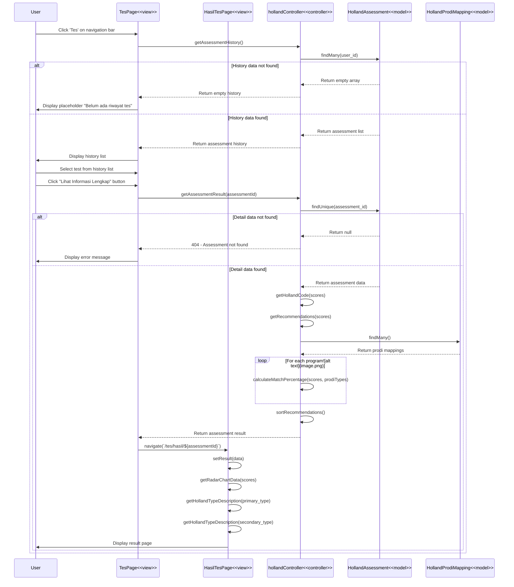

# Lihat Hasil Tes - Code Flow Documentation

## Overview

This document describes the code flow for the "Lihat Hasil Tes" (View Test Results) feature. The flow allows users to view detailed results from their previously completed Holland RIASEC career assessment tests, including scores, personality analysis, and program recommendations.

## Activity Diagram Flow

1. User selects one of the test history records
2. User clicks "Lihat Informasi Lengkap" button
3. System fetches detailed test result data from database
4. **[Data found]** → System redirects user to test result page and displays detailed result information
5. **[Data not found]** → System displays placeholder error message for failed result loading

## Technical Stack

- **Frontend**: React + TypeScript, React Router, Axios, Chart.js (Radar chart)
- **Backend**: Express.js, Prisma ORM
- **Database**: PostgreSQL
- **State Management**: React State (useState, useEffect)
- **Visualization**: Chart.js with Radar chart for Holland scores

## Architecture Components

### Frontend Pages

1. **Tes Page** (`client/src/pages/user/Tes/index.tsx`)

   - Display assessment history list
   - Handle test selection
   - Show test session information

2. **InfoTes Component** (`client/src/pages/user/Tes/Components/InfoTes.tsx`)

   - Display selected test summary
   - Fetch assessment detail
   - Navigate to full result page
   - Show Holland scores preview
   - "Lihat Detail Lengkap" button

3. **Tes-Hasil Page** (`client/src/pages/user/Tes-Hasil/index.tsx`)
   - Display full assessment results
   - Show radar chart visualization
   - Display personality descriptions
   - Show program recommendations with match percentages
   - Handle result not found error

### Backend Components

1. **Holland Controller** (`server/src/controllers/hollandController.ts`)
   - `getAssessmentResult(assessmentId)` - Retrieve specific assessment result with recommendations

### Database Models

- **HollandAssessment** - Assessment records with scores and Holland code
- **HollandProdiMapping** - Program study mappings to Holland types
- **Prodi** - Program study details

## Sequence Diagram



## Data Flow Details

### 1. Assessment Selection Flow

**User Selection**:

```typescript
// On TesPage
const [selectedTesSession, setSelectedTesSession] = useState<TesSession | null>(
  null
);

// User clicks on a test card
setSelectedTesSession(tesSession);

// Pass to InfoTes component
<InfoTes tesSession={selectedTesSession} />;
```

### 2. Assessment Detail Fetching

**InfoTes Component**:

```typescript
// Trigger on selection change
useEffect(() => {
  if (tesSession?.status === "COMPLETED") {
    fetchAssessmentDetail();
  }
}, [tesSession?.test_id]);

// Fetch detail from backend
const fetchAssessmentDetail = async () => {
  const response = await axios.get(
    `${API_URL}/api/holland/result/${tesSession.test_id}`,
    { headers: { Authorization: `Bearer ${token}` } }
  );
  setAssessmentDetail(response.data.data);
};
```

### 3. Navigation to Full Result Page

**Navigate with assessmentId**:

```typescript
// InfoTes component button
onClick={() => navigate(`/tes/hasil/${tesSession.test_id}`)}

// HasilTesPage receives assessmentId from URL params
const { assessmentId } = useParams<{ assessmentId: string }>();
```

### 4. Result Page Data Loading

**HasilTesPage Component**:

```typescript
// Check if result already passed via location.state or needs fetching
const [result, setResult] = useState<AssessmentResult | null>(
  location.state?.result || null
);

useEffect(() => {
  if (!result && assessmentId) {
    fetchResult(); // Fetch if not in state
  }
}, [assessmentId]);

const fetchResult = async () => {
  const response = await axios.get(
    `${API_URL}/api/holland/result/${assessmentId}`,
    { headers: { Authorization: `Bearer ${token}` } }
  );
  setResult(response.data.data);
};
```

### 5. Assessment Result Structure

```typescript
interface AssessmentResult {
  assessment_id: string;
  scores: {
    realistic: number; // 10-50
    investigative: number; // 10-50
    artistic: number; // 10-50
    social: number; // 10-50
    enterprising: number; // 10-50
    conventional: number; // 10-50
  };
  primary_type: HollandType;
  secondary_type: HollandType | null;
  tertiary_type: HollandType | null;
  holland_code: string; // e.g., "RIA"
  completed_at: string;
  recommendations: Array<{
    prodi_id: number;
    nama_prodi: string;
    jenjang: string | null;
    match_percentage: number;
    rank: number;
    primary_type: HollandType;
    secondary_type: HollandType | null;
  }>;
}
```

## API Endpoint

### GET `/api/holland/result/:assessmentId`

**Purpose**: Get detailed assessment result with recommendations

**Authorization**: JWT token required

**Parameters**:

- `assessmentId` (URL parameter) - Assessment ID to retrieve

**Response Success (200)**:

```json
{
  "success": true,
  "data": {
    "assessment_id": "abc123",
    "scores": {
      "realistic": 42,
      "investigative": 38,
      "artistic": 45,
      "social": 30,
      "enterprising": 25,
      "conventional": 28
    },
    "primary_type": "ARTISTIC",
    "secondary_type": "REALISTIC",
    "tertiary_type": "INVESTIGATIVE",
    "holland_code": "ARI",
    "completed_at": "2024-01-15T10:30:00Z",
    "recommendations": [
      {
        "prodi_id": 123,
        "nama_prodi": "Desain Komunikasi Visual",
        "jenjang": "S1",
        "match_percentage": 92,
        "rank": 1,
        "primary_type": "ARTISTIC",
        "secondary_type": "REALISTIC"
      }
      // ... 9 more recommendations (top 10)
    ]
  },
  "message": "Assessment result retrieved successfully"
}
```

**Response Error (404)**:

```json
{
  "success": false,
  "message": "Assessment not found"
}
```

**Response Error (401)**:

```json
{
  "success": false,
  "message": "User not authenticated"
}
```

## Key Features

### 1. Two-Stage Loading

**Stage 1 - InfoTes Preview**:

- Fetch assessment detail when test is selected
- Display Holland Code and types
- Show score bars preview
- Display recommendations count
- "Lihat Detail Lengkap" button enabled

**Stage 2 - HasilTesPage Full View**:

- Navigate to dedicated result page
- Fetch full assessment data (if not cached)
- Display radar chart visualization
- Show detailed personality descriptions
- List top 10 program recommendations

### 2. Error Handling

**InfoTes Component**:

- Silent error handling (console.error)
- Show basic summary if detail fetch fails
- Still allow navigation to full page

**HasilTesPage Component**:

- Loading spinner during data fetch
- Error state with user-friendly message
- "Kembali" button to navigate back to home
- Handle 401/403 with automatic logout

### 3. Data Visualization

**Radar Chart**:

```typescript
const getRadarChartData = () => {
  const labels = [
    "Realistis (R)",
    "Investigatif (I)",
    "Artistik (A)",
    "Sosial (S)",
    "Enterprising (E)",
    "Konvensional (C)",
  ];

  const data = [
    result.scores.realistic,
    result.scores.investigative,
    result.scores.artistic,
    result.scores.social,
    result.scores.enterprising,
    result.scores.conventional,
  ];

  // Chart.js configuration with 6-point radar
  // Scale: 0-50, Step: 10
};
```

**Score Bars (InfoTes Preview)**:

```typescript
// For each Holland type
const percentage = (score / 50) * 100;

// Render progress bar
<div className="w-full bg-gray-200 rounded-full h-2">
  <div
    className={`h-2 rounded-full ${getHollandTypeColor(type)}`}
    style={{ width: `${percentage}%` }}
  />
</div>;
```

### 4. Color Coding by Holland Type

```typescript
const getHollandTypeColor = (type: HollandType): string => {
  const colors: Record<HollandType, string> = {
    REALISTIC: "bg-primary", // Blue
    INVESTIGATIVE: "bg-purple-500", // Purple
    ARTISTIC: "bg-pink-500", // Pink
    SOCIAL: "bg-green-500", // Green
    ENTERPRISING: "bg-orange-500", // Orange
    CONVENTIONAL: "bg-gray-500", // Gray
  };
  return colors[type];
};
```

### 5. Authorization Check

**Backend Validation**:

```typescript
// Verify user owns the assessment
const assessment = await prisma.hollandAssessment.findUnique({
  where: { assessment_id: assessmentId },
});

if (!assessment || assessment.user_id !== userId) {
  return res.status(404).json({
    success: false,
    message: "Assessment not found",
  });
}
```

## User Experience Flow

1. **Select Test** → User clicks on test card from history list
2. **Preview Info** → InfoTes component shows summary with scores preview
3. **Click Detail Button** → User clicks "Lihat Detail Lengkap"
4. **Navigate** → System navigates to `/tes/hasil/:assessmentId`
5. **Load Result** → HasilTesPage fetches full assessment data
6. **Display Visualization** → Radar chart rendered with Chart.js
7. **Show Descriptions** → Primary and secondary personality descriptions displayed
8. **List Recommendations** → Top 10 program recommendations with match percentages

## Error States

### InfoTes Component Errors

1. **Fetch Failed**:

   - Silent error (console.error)
   - Display basic summary from tesSession.result_summary
   - Still allow navigation to full page

2. **Authentication Error (401/403)**:
   - Auto logout user
   - Redirect to login page

### HasilTesPage Component Errors

1. **Assessment Not Found (404)**:

   - Display error card with message
   - Show "Kembali" button to return to home
   - Message: "Hasil tidak ditemukan"

2. **Network/Server Error**:

   - Display error card
   - Show error message from backend
   - "Kembali" button available

3. **Loading State**:
   - Full-screen loading spinner
   - Prevents interaction until data loaded

## Performance Optimizations

1. **Conditional Fetching**: Only fetch detail for COMPLETED tests
2. **Result Caching**: Check location.state before fetching
3. **Lazy Chart Loading**: Chart.js only loaded on result page
4. **Top 10 Limit**: Backend returns only top 10 recommendations (not all)
5. **Component Memoization**: InfoTes updates only on tesSession change

## Database Queries

### Get Assessment Result

```typescript
// Fetch assessment with user relation
const assessment = await prisma.hollandAssessment.findUnique({
  where: { assessment_id: assessmentId },
  include: {
    user: {
      select: {
        user_id: true,
        firstname: true,
        lastname: true,
        email: true,
      },
    },
  },
});

// Fetch all prodi mappings
const mappings = await prisma.hollandProdiMapping.findMany({
  include: {
    prodi: {
      select: {
        prodi_id: true,
        nama_prodi: true,
        jenjang: true,
      },
    },
  },
});
```

---

**Last Updated**: 2024-01-15  
**Version**: 1.0  
**Related Diagrams**: Activity Diagram - Lihat Hasil Tes  
**Related Documentation**: TES_MINAT_BAKAT_CODE_FLOW.md
