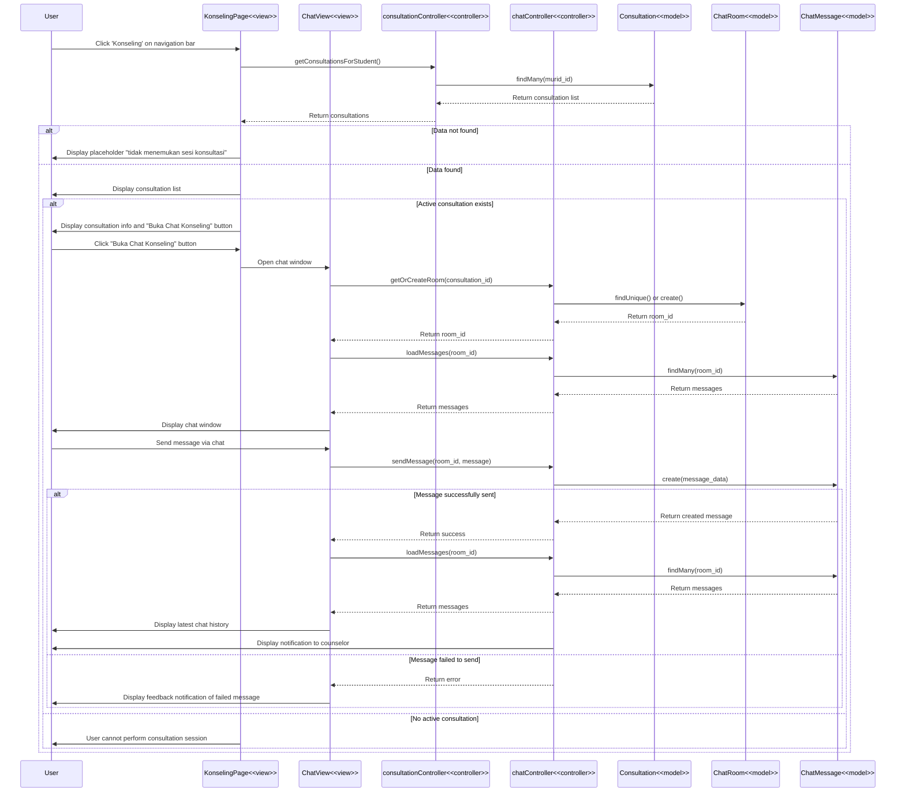

# Lihat Konsultasi dan Chat - Code Flow Documentation

## Overview

This document describes the code flow for the "Lihat Konsultasi dan Chat" (View Consultation and Chat) feature. The flow allows students to view their consultation sessions, check active consultations, and chat with counselors during accepted consultation sessions.

## Activity Diagram Flow

1. User accesses EDUPATH main page → System displays homepage
2. User clicks 'Konseling' on navigation bar → System displays Konseling page
3. System fetches consultation session data from database
4. **[Data found]** → System displays consultation session list in user account
5. **[Data not found]** → System displays placeholder "tidak menemukan sesi konsultasi"
6. **[Active consultation session exists]** → System displays detailed info about active session and "Buka Chat Konseling" button
7. **[No active consultation session]** → User cannot perform consultation session with counselor
8. User clicks "Buka Chat Konseling" button → System displays chat window with counselor
9. User sends message via chat → System sends user message to related counselor
10. **[Message successfully sent]** → System displays consultation session list → System displays notification of new message to related counselor → System saves latest message to database → System displays latest chat history in chat window
11. **[Message failed to send]** → System displays feedback notification of failed message

## Technical Stack

- **Frontend**: React + TypeScript, React Router, Axios
- **Backend**: Express.js, Prisma ORM
- **Database**: PostgreSQL
- **Real-time**: Polling mechanism (5-second interval)
- **Image Upload**: Cloudinary

## Architecture Components

### Frontend Pages

1. **Konseling Page** (`client/src/pages/user/Konseling/index.tsx`)

   - Display consultation list
   - Fetch consultation data
   - Handle active consultation check
   - Navigate to chat view

2. **ConsultationInfo Component** (`client/src/pages/user/Konseling/components/ConsultationInfo.tsx`)

   - Display detailed consultation information
   - Check chat availability
   - Handle "Buka Chat" button

3. **ChatView Component** (`client/src/pages/user/Konseling/components/ChatView.tsx`)
   - Display chat interface
   - Send and receive messages
   - Handle message polling
   - Image upload support

### Backend Components

1. **Consultation Controller** (`server/src/controllers/consultationController.ts`)

   - `getConsultationsForStudent()` - Get student's consultations

2. **Chat Controller** (`server/src/controllers/chatController.ts`)
   - `getOrCreateRoom()` - Get or create chat room
   - `loadMessages()` - Load chat messages
   - `sendMessage()` - Send new message

### Database Models

- **Consultation** - Consultation sessions
- **ChatRoom** - Chat room for consultations
- **ChatMessage** - Messages in chat rooms

## Sequence Diagram



## Data Flow Details

### 1. Fetch Consultations

**Frontend**:

```typescript
const fetchConsultations = async () => {
  const token = TokenManager.getToken();
  const response = await axios.get(`${API_URL}/api/consultations`, {
    headers: { Authorization: `Bearer ${token}` },
  });
  if (response.data.success && response.data.data) {
    setConsultations(response.data.data);
  }
};
```

**Backend**:

```typescript
async getConsultationsForStudent(req: Request, res: Response) {
  const userId = req.user?.userId;

  const consultations = await prisma.consultation.findMany({
    where: { murid_id: userId },
    orderBy: { created_at: 'desc' },
  });

  return res.status(200).json({
    success: true,
    data: consultations,
  });
}
```

### 2. Check Active Consultation

**Frontend Logic**:

```typescript
const hasActiveConsultation = consultations.some((c) => c.is_active);

const isChatAvailable = () => {
  if (
    !consultation ||
    consultation.status !== "ACCEPTED" ||
    !consultation.is_active
  ) {
    return false;
  }

  const consultationStartTime = new Date(consultation.consultation_date);
  const now = new Date();

  return now >= consultationStartTime;
};
```

### 3. Get or Create Chat Room

**Frontend**:

```typescript
async getOrCreateRoom(consultationId: string): Promise<string | null> {
  const token = TokenManager.getToken();
  const response = await axios.get(
    `${API_URL}/api/chat/room/${consultationId}`,
    { headers: { Authorization: `Bearer ${token}` } }
  );

  if (response.data.success && response.data.data.room_id) {
    return response.data.data.room_id;
  }
  return null;
}
```

### 4. Load Messages

**Frontend**:

```typescript
async loadMessages(roomId: string): Promise<Message[]> {
  const token = TokenManager.getToken();
  const response = await axios.get(
    `${API_URL}/api/chat/messages/${roomId}`,
    { headers: { Authorization: `Bearer ${token}` } }
  );

  if (response.data.success) {
    return response.data.data || [];
  }
  return [];
}
```

### 5. Send Message

**Frontend**:

```typescript
async sendMessage(roomId: string, message: string): Promise<Message | null> {
  const token = TokenManager.getToken();
  const response = await axios.post(
    `${API_URL}/api/chat/messages/${roomId}`,
    { message },
    { headers: { Authorization: `Bearer ${token}` } }
  );

  if (response.data.success && response.data.data) {
    return response.data.data;
  }
  return null;
}
```

### 6. Message Polling

**Frontend**:

```typescript
startPolling(roomId: string, intervalMs: number = 5000) {
  this.pollingInterval = setInterval(async () => {
    const messages = await this.loadMessages(roomId);
    this.notifyMessageHandlers(messages);
  }, intervalMs);
}
```

## Data Structures

### Consultation

```typescript
interface Consultation {
  consultation_id: string;
  murid_id: string;
  admin_id: string;
  topic: string;
  consultation_date: string;
  consultation_time: string;
  status: "PENDING" | "ACCEPTED" | "DECLINED" | "COMPLETED";
  is_active: boolean;
  description?: string;
  created_at: string;
  updated_at: string;
}
```

### Message

```typescript
interface Message {
  id: string;
  message: string;
  senderId: string;
  senderName: string;
  timestamp: string;
  isFromAdmin: boolean;
}
```

## API Endpoints

### GET `/api/consultations`

**Purpose**: Get all consultations for current student

**Authorization**: JWT token required

**Response Success (200)**:

```json
{
  "success": true,
  "data": [
    {
      "consultation_id": "CONS-2024-001",
      "topic": "Konsultasi Pemilihan Jurusan",
      "consultation_date": "2024-01-20T10:00:00.000Z",
      "status": "ACCEPTED",
      "is_active": true
    }
  ]
}
```

**Response Empty (200)**:

```json
{
  "success": true,
  "data": []
}
```

### GET `/api/chat/room/:consultationId`

**Purpose**: Get or create chat room for consultation

**Authorization**: JWT token required

**Response Success (200)**:

```json
{
  "success": true,
  "data": {
    "room_id": "ROOM-2024-001",
    "consultation_id": "CONS-2024-001"
  }
}
```

### GET `/api/chat/messages/:roomId`

**Purpose**: Get all messages in chat room

**Authorization**: JWT token required

**Response Success (200)**:

```json
{
  "success": true,
  "data": [
    {
      "id": "MSG-001",
      "message": "Halo, saya ingin berkonsultasi",
      "senderId": "user123",
      "senderName": "John Doe",
      "timestamp": "2024-01-20T10:05:00.000Z",
      "isFromAdmin": false
    }
  ]
}
```

### POST `/api/chat/messages/:roomId`

**Purpose**: Send new message to chat room

**Authorization**: JWT token required

**Request Body**:

```json
{
  "message": "Halo, saya ingin berkonsultasi tentang pemilihan jurusan"
}
```

**Response Success (201)**:

```json
{
  "success": true,
  "data": {
    "id": "MSG-001",
    "message": "Halo, saya ingin berkonsultasi tentang pemilihan jurusan",
    "senderId": "user123",
    "senderName": "John Doe",
    "timestamp": "2024-01-20T10:05:00.000Z",
    "isFromAdmin": false
  }
}
```

**Response Error (400)**:

```json
{
  "success": false,
  "message": "Gagal mengirim pesan"
}
```

## Key Features

### 1. Empty State Handling

**Conditions**:

- No consultations exist for student
- Display placeholder message

**UI Behavior**:

```typescript
{
  consultations.length === 0 && <p>Tidak menemukan sesi konsultasi</p>;
}
```

### 2. Active Consultation Detection

**Logic**:

```typescript
const hasActiveConsultation = consultations.some((c) => c.is_active);
```

**Criteria**:

- `is_active === true`
- `status === "ACCEPTED"`
- Current time >= consultation start time

### 3. Chat Availability Check

**Conditions for Chat**:

1. Consultation status must be "ACCEPTED"
2. Consultation must be active (`is_active === true`)
3. Current time must be >= consultation start time

**Error Messages**:

- "Chat hanya tersedia untuk konsultasi yang sudah diterima"
- "Chat akan tersedia saat waktu konseling dimulai"

### 4. Real-time Message Updates

**Polling Mechanism**:

- Interval: 5 seconds
- Auto-fetch new messages
- Update UI automatically
- Stop polling when chat closes

**Implementation**:

```typescript
chatHandler.startPolling(roomId, 5000);

// Cleanup on unmount
return () => {
  chatHandler.stopPolling();
};
```

### 5. Message Sending Flow

**Steps**:

1. User types message
2. Click send button
3. Upload image (if selected) to Cloudinary
4. Send message to backend
5. Backend saves to database
6. Polling fetches new messages
7. Display updated chat history

**Error Handling**:

- Network errors → Display error toast
- Upload failures → Show upload error
- Send failures → Display "Gagal mengirim pesan"

## User Experience Flow

1. **Access Page** → User clicks 'Konseling' on navigation
2. **Fetch Data** → System retrieves consultation sessions
3. **Display List** → System shows consultations or empty state
4. **Check Active** → System identifies active consultation
5. **View Details** → User sees consultation information
6. **Open Chat** → User clicks "Buka Chat Konseling"
7. **Initialize Chat** → System creates/gets chat room
8. **Load Messages** → System fetches message history
9. **Display Chat** → User sees chat interface
10. **Send Message** → User types and sends message
11. **Update Chat** → System polls and updates messages
12. **Notify** → Counselor receives notification

## Error States

### Empty State

- **Condition**: No consultations found
- **Message**: "Tidak menemukan sesi konsultasi"
- **Action**: Display placeholder

### No Active Consultation

- **Condition**: No active consultation exists
- **Message**: "User tidak dapat melakukan sesi konsultasi dengan ahli"
- **Action**: Disable chat button

### Chat Not Available

- **Condition**: Consultation not accepted or not started
- **Message**: "Chat hanya tersedia untuk konsultasi yang sudah diterima"
- **Action**: Show error toast

### Send Message Failed

- **Condition**: Network error or server error
- **Message**: "Gagal mengirim pesan"
- **Action**: Display error notification

## Performance Optimizations

1. **Polling Optimization**: 5-second interval to balance real-time updates and server load
2. **Message Deduplication**: Check message IDs to prevent duplicate renders
3. **Cleanup on Unmount**: Stop polling when chat closes
4. **Lazy Chat Loading**: Initialize chat only when user opens it
5. **Image Compression**: Compress images before upload to Cloudinary

## Database Queries

### Fetch Consultations

```typescript
const consultations = await prisma.consultation.findMany({
  where: { murid_id: userId },
  orderBy: { created_at: "desc" },
});
```

### Get or Create Chat Room

```typescript
let room = await prisma.chatRoom.findUnique({
  where: { consultation_id: consultationId },
});

if (!room) {
  room = await prisma.chatRoom.create({
    data: {
      room_id: generateRoomId(),
      consultation_id: consultationId,
    },
  });
}
```

### Load Messages

```typescript
const messages = await prisma.chatMessage.findMany({
  where: { room_id: roomId },
  orderBy: { created_at: "asc" },
});
```

### Send Message

```typescript
const message = await prisma.chatMessage.create({
  data: {
    room_id: roomId,
    sender_id: userId,
    message: messageText,
  },
});
```

---

**Last Updated**: 2024-01-15  
**Version**: 1.0  
**Related Diagrams**: Activity Diagram - Lihat Konsultasi dan Chat  
**Related Documentation**: MEMBUAT_JADWAL_KONSULTASI_CODE_FLOW.md, TES_MINAT_BAKAT_CODE_FLOW.md
