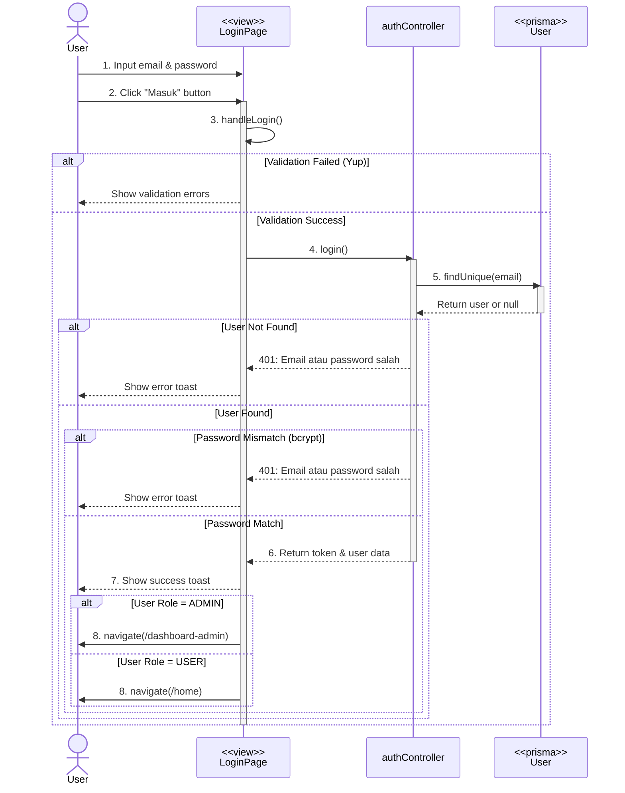

# LOGIN FLOW - Complete Documentation

## 📋 Overview

Dokumentasi lengkap alur login dari user input sampai redirect ke halaman dashboard/home.

---

## 🎭 Mermaid Sequence Diagram



---

## 🎯 Flow Diagram Summary

```
User Input (View)
    ↓
Frontend Validation (Yup Schema)
    ↓
API Request (POST /api/auth/login)
    ↓
Backend Router (authRoutes.ts)
    ↓
Controller (authController.login)
    ↓
Database Query (Prisma - User)
    ↓
Password Verification (bcrypt.compare)
    ↓
JWT Token Generation (jwt.sign)
    ↓
Response to Frontend
    ↓
Token Storage (TokenManager)
    ↓
Role-based Redirect
    ↓
View (Dashboard/Home)
```

---

## 📝 Detailed Step-by-Step Flow

### **STEP 1: User Input (Frontend View)**

**File:** `client/src/pages/auth/Login.tsx`

```typescript
// User mengisi form
<AuthInput
  type="email"
  value={email}
  onChange={(e) => setEmail(e.target.value)}
/>

<AuthPasswordInput
  value={password}
  onChange={(e) => setPassword(e.target.value)}
/>

// User klik tombol "Masuk" atau Enter
<AuthButton onClick={handleLogin}>
  Masuk
</AuthButton>
```

**State yang digunakan:**

- `email`: string
- `password`: string
- `submitted`: boolean
- `errors`: { email?: string; password?: string }
- `serverError`: string

---

### **STEP 2: Frontend Validation**

**File:** `client/src/pages/auth/Login.tsx` (handleLogin function)

```typescript
const handleLogin = async () => {
  setErrors({});
  setSubmitted(true);
  setServerError("");

  try {
    // Validasi menggunakan Yup Schema
    await loginSchema.validate({ email, password }, { abortEarly: false });

    // Jika validasi lolos, lanjut ke API request...
  } catch (err) {
    // Handle validation errors
    if (err instanceof ValidationError) {
      const newErrors = {};
      err.inner.forEach((e) => {
        newErrors[e.path] = e.message;
      });
      setErrors(newErrors);
      return; // Stop execution
    }
  }
};
```

**Validation Schema:** `client/src/schema/LoginSchema.tsx`

```typescript
export const loginSchema = yup.object().shape({
  email: yup.string().email("Email tidak valid").required("Email wajib diisi"),
  password: yup
    .string()
    .min(6, "Password minimal 6 karakter")
    .required("Password wajib diisi"),
});
```

**Output:**

- ✅ Valid → Lanjut ke Step 3
- ❌ Invalid → Show error messages, stop execution

---

### **STEP 3: API Request to Backend**

**File:** `client/src/pages/auth/Login.tsx`

```typescript
const response = await axios.post<{ data: LoginResponse }>(
  `${API_URL}/api/auth/login`,
  { email, password }
);
```

**Request Details:**

- **Method:** POST
- **URL:** `http://localhost:5000/api/auth/login`
- **Headers:**
  ```
  Content-Type: application/json
  ```
- **Body:**
  ```json
  {
    "email": "user@example.com",
    "password": "password123"
  }
  ```

---

### **STEP 4: Backend Router**

**File:** `server/src/routes/authRoutes.ts`

```typescript
import { Router } from "express";
import { AuthController } from "../controllers/authController";

const router = Router();
const controller = new AuthController();

router.post("/login", controller.login.bind(controller));
```

**Action:**

- Route menerima POST request ke `/api/auth/login`
- Forward request ke `AuthController.login()`

---

### **STEP 5: Controller - Login Logic**

**File:** `server/src/controllers/authController.ts`

#### **5.1 Validasi Input**

```typescript
async login(req: Request, res: Response): Promise<void> {
  const { email, password } = req.body;

  if (!email || !password) {
    res.status(400).json({
      success: false,
      message: "Email dan password wajib diisi",
    });
    return;
  }
```

#### **5.2 Query User dari Database**

```typescript
const user = await prisma.user.findUnique({
  where: { email: email.toLowerCase() },
});

if (!user || !user.password) {
  res.status(401).json({
    success: false,
    message: "Email atau password salah",
  });
  return;
}
```

**Prisma Query:**

- Cari user berdasarkan email (case-insensitive)
- Jika tidak ada → Return 401 Unauthorized

#### **5.3 Verify Password**

```typescript
const isMatch = await bcrypt.compare(password, user.password);

if (!isMatch) {
  res.status(401).json({
    success: false,
    message: "Email atau password salah",
  });
  return;
}
```

**bcrypt.compare():**

- Compare plain password dengan hashed password di database
- Return boolean: true (match) / false (not match)

#### **5.4 Generate JWT Token**

```typescript
const token = jwt.sign(
  {
    user_id: user.user_id,
    firstname: user.firstname,
    lastname: user.lastname,
    email: user.email,
    role: user.role,
    kelas: user.kelas,
  },
  process.env.JWT_SECRET as string,
  { expiresIn: process.env.JWT_EXPIRES_IN || "1d" }
);
```

**JWT Token:**

- **Payload:** User data (user_id, email, role, dll)
- **Secret:** dari environment variable `JWT_SECRET`
- **Expiry:** 1 hari (default)

#### **5.5 Send Response**

```typescript
res.status(200).json({
  success: true,
  data: {
    message: "Login berhasil",
    token,
    user: {
      user_id: user.user_id,
      email: user.email,
      firstname: user.firstname,
      lastname: user.lastname,
      role: user.role,
      kelas: user.kelas,
    },
  },
  message: "Login successful",
});
```

**Response Structure:**

```json
{
  "success": true,
  "data": {
    "message": "Login berhasil",
    "token": "eyJhbGciOiJIUzI1NiIsInR5cCI6IkpXVCJ9...",
    "user": {
      "user_id": "US001",
      "email": "user@example.com",
      "firstname": "John",
      "lastname": "Doe",
      "role": "USER",
      "kelas": 12
    }
  },
  "message": "Login successful"
}
```

---

### **STEP 6: Frontend Receives Response**

**File:** `client/src/pages/auth/Login.tsx`

```typescript
const response = await axios.post<{ data: LoginResponse }>(
  `${API_URL}/api/auth/login`,
  { email, password }
);

const result = response.data.data;
```

**Response Handling:**

- Success (200) → Extract `token` dan `user` data
- Error (400/401) → Catch error dan tampilkan message

---

### **STEP 7: Clear Old Auth Data**

**File:** `client/src/pages/auth/Login.tsx`

```typescript
TokenManager.clearAllAuthData();
```

**TokenManager Action:**

```typescript
static clearAllAuthData(): void {
  localStorage.removeItem("user_id");
  localStorage.removeItem("role");
  localStorage.removeItem("token_data");
}
```

**Purpose:**

- Hapus data auth lama untuk menghindari konflik
- Pastikan localStorage clean sebelum simpan data baru

---

### **STEP 8: Store Token & User Data**

**File:** `client/src/pages/auth/Login.tsx`

```typescript
TokenManager.setToken(result.token, 1); // Token berlaku 1 hari
TokenManager.setUserData(result.user.user_id, result.user.role);
```

#### **8.1 setToken()**

**File:** `client/src/utils/tokenManager.ts`

```typescript
static setToken(token: string, expiresInDays: number = 1): void {
  const timestamp = Date.now();
  const expiresIn = expiresInDays * 24 * 60 * 60 * 1000; // to milliseconds

  const tokenData: TokenData = {
    token,
    timestamp,
    expiresIn,
  };

  localStorage.setItem("token_data", JSON.stringify(tokenData));
}
```

**LocalStorage Structure:**

```json
{
  "token_data": {
    "token": "eyJhbGciOiJIUzI1NiIsInR5cCI6IkpXVCJ9...",
    "timestamp": 1733587200000,
    "expiresIn": 86400000
  }
}
```

#### **8.2 setUserData()**

```typescript
static setUserData(userId: string, role: string): void {
  localStorage.setItem("user_id", userId);
  localStorage.setItem("role", role);
}
```

**LocalStorage:**

```
user_id: "US001"
role: "USER" or "ADMIN"
```

---

### **STEP 9: Show Success Toast**

**File:** `client/src/pages/auth/Login.tsx`

```typescript
toast.success("Login berhasil!");
```

**Toast Notification:**

- Library: `react-hot-toast`
- Show success message di pojok kanan atas
- Auto dismiss after 3 seconds

---

### **STEP 10: Role-Based Redirect**

**File:** `client/src/pages/auth/Login.tsx`

```typescript
if (result.user.role === "ADMIN") {
  navigate("/dashboard-admin");
} else {
  navigate("/home");
}
```

**Routing Logic:**

- **ADMIN** → `/dashboard-admin`
- **USER/STUDENT** → `/home`

**React Router:**

- `useNavigate()` hook untuk programmatic navigation
- Page akan re-render dengan route baru

---

### **STEP 11: View Destination Page**

#### **For ADMIN:**

**Route:** `/dashboard-admin`
**File:** `client/src/pages/admin/Dashboard/DashboardAdmin.tsx`

#### **For USER:**

**Route:** `/home`
**File:** `client/src/pages/user/Home/Home.tsx`

**Protected Route Check:**

```typescript
// Setiap protected page biasanya cek:
useEffect(() => {
  if (!TokenManager.isAuthenticated()) {
    navigate("/login");
  }
}, []);
```

---

## 🔒 Security Features

### **1. Password Hashing**

```typescript
// Register: Hash password before save
const hashed = await bcrypt.hash(password, 10);

// Login: Compare plain password dengan hashed
const isMatch = await bcrypt.compare(password, user.password);
```

### **2. JWT Token**

```typescript
// Generate token dengan expiry
const token = jwt.sign(payload, secret, { expiresIn: "1d" });

// Verify token di middleware (untuk protected routes)
const decoded = jwt.verify(token, secret);
```

### **3. Token Expiry Management**

```typescript
// TokenManager auto check expiry
static isTokenValid(): boolean {
  const now = Date.now();
  const tokenAge = now - tokenData.timestamp;
  return tokenAge < tokenData.expiresIn;
}

// Auto clear jika expired
if (!this.isTokenValid()) {
  this.clearAllAuthData();
  return null;
}
```

### **4. Case-Insensitive Email**

```typescript
// Email always converted to lowercase
const user = await prisma.user.findUnique({
  where: { email: email.toLowerCase() },
});
```

---

## ⚠️ Error Handling

### **Frontend Errors:**

#### **1. Validation Errors**

```typescript
catch (err) {
  if (err instanceof ValidationError) {
    const newErrors = {};
    err.inner.forEach((e) => {
      newErrors[e.path] = e.message;
    });
    setErrors(newErrors); // Show di form input
  }
}
```

#### **2. Server Errors**

```typescript
catch (err: any) {
  const errorMessage =
    err.response?.data?.message || "Email atau password salah";
  setServerError(errorMessage);
  toast.error(errorMessage); // Show toast notification
}
```

### **Backend Errors:**

#### **1. Missing Fields (400)**

```typescript
if (!email || !password) {
  res.status(400).json({
    success: false,
    message: "Email dan password wajib diisi",
  });
}
```

#### **2. Invalid Credentials (401)**

```typescript
if (!user || !user.password || !isMatch) {
  res.status(401).json({
    success: false,
    message: "Email atau password salah",
  });
}
```

---

## 📊 Data Flow Diagram

```
┌─────────────┐
│   USER      │
│  (Browser)  │
└──────┬──────┘
       │ 1. Input email & password
       │ 2. Click "Masuk"
       ↓
┌──────────────────────┐
│   Login.tsx          │
│  - handleLogin()     │
└──────┬───────────────┘
       │ 3. Validate with Yup Schema
       ↓
┌──────────────────────┐
│  LoginSchema.tsx     │
│  - Email validation  │
│  - Password min 6    │
└──────┬───────────────┘
       │ 4. POST /api/auth/login
       ↓
┌──────────────────────┐
│   authRoutes.ts      │
│  - Route handler     │
└──────┬───────────────┘
       │ 5. Forward to controller
       ↓
┌──────────────────────┐
│  authController.ts   │
│  - login()           │
└──────┬───────────────┘
       │ 6. Query database
       ↓
┌──────────────────────┐
│   Prisma Client      │
│  - findUnique()      │
└──────┬───────────────┘
       │ 7. User data
       ↓
┌──────────────────────┐
│   Database           │
│  (PostgreSQL/MySQL)  │
└──────┬───────────────┘
       │ 8. Return user record
       ↓
┌──────────────────────┐
│  authController.ts   │
│  - bcrypt.compare()  │
│  - jwt.sign()        │
└──────┬───────────────┘
       │ 9. Response with token & user
       ↓
┌──────────────────────┐
│   Login.tsx          │
│  - Receive response  │
└──────┬───────────────┘
       │ 10. Store token & user data
       ↓
┌──────────────────────┐
│   TokenManager       │
│  - setToken()        │
│  - setUserData()     │
└──────┬───────────────┘
       │ 11. Save to localStorage
       ↓
┌──────────────────────┐
│   localStorage       │
│  - token_data        │
│  - user_id           │
│  - role              │
└──────┬───────────────┘
       │ 12. Navigate based on role
       ↓
┌──────────────────────┐
│  React Router        │
│  - navigate()        │
└──────┬───────────────┘
       │ 13. Render destination page
       ↓
┌──────────────────────┐
│   Dashboard/Home     │
│  (Protected Route)   │
└──────────────────────┘
```

---

## 🔑 Key Components

### **Frontend:**

1. **Login.tsx** - Main login page component
2. **LoginSchema.tsx** - Yup validation schema
3. **TokenManager.ts** - Token & auth data management
4. **AuthLayout.tsx** - Layout wrapper untuk auth pages
5. **AuthInput.tsx** - Reusable input component
6. **AuthPasswordInput.tsx** - Password input dengan show/hide
7. **AuthButton.tsx** - Reusable button component

### **Backend:**

1. **authRoutes.ts** - Route definitions
2. **authController.ts** - Business logic
3. **prisma.ts** - Database client
4. **authMiddleware.ts** - JWT verification (untuk protected routes)

### **Libraries:**

- **axios** - HTTP client
- **yup** - Validation
- **react-hot-toast** - Notifications
- **bcrypt** - Password hashing
- **jsonwebtoken** - JWT token generation
- **prisma** - ORM database

---

## 📦 LocalStorage Structure After Login

```javascript
localStorage = {
  token_data:
    '{"token":"eyJhbG...","timestamp":1733587200000,"expiresIn":86400000}',
  user_id: "US001",
  role: "USER",
};
```

---

## 🚀 Success Response Example

```json
{
  "success": true,
  "data": {
    "message": "Login berhasil",
    "token": "eyJhbGciOiJIUzI1NiIsInR5cCI6IkpXVCJ9.eyJ1c2VyX2lkIjoiVVMwMDEiLCJmaXJzdG5hbWUiOiJKb2huIiwibGFzdG5hbWUiOiJEb2UiLCJlbWFpbCI6ImpvaG5AZXhhbXBsZS5jb20iLCJyb2xlIjoiVVNFUiIsImtsYXMiOjEyLCJpYXQiOjE3MzM1ODcyMDAsImV4cCI6MTczMzY3MzYwMH0.abc123xyz",
    "user": {
      "user_id": "US001",
      "email": "john@example.com",
      "firstname": "John",
      "lastname": "Doe",
      "role": "USER",
      "kelas": 12
    }
  },
  "message": "Login successful"
}
```

---

## ❌ Error Response Examples

### **Validation Error (Frontend):**

```javascript
{
  email: "Email tidak valid",
  password: "Password minimal 6 karakter"
}
```

### **Missing Fields (Backend 400):**

```json
{
  "success": false,
  "message": "Email dan password wajib diisi"
}
```

### **Invalid Credentials (Backend 401):**

```json
{
  "success": false,
  "message": "Email atau password salah"
}
```

---

## 🎬 Complete Timeline

1. **T+0ms** - User input email & password
2. **T+10ms** - Click "Masuk" button
3. **T+15ms** - Frontend validation (Yup)
4. **T+20ms** - API request sent
5. **T+150ms** - Backend receives request
6. **T+155ms** - Database query
7. **T+200ms** - Password verification
8. **T+210ms** - JWT token generation
9. **T+220ms** - Response sent to frontend
10. **T+250ms** - Frontend receives response
11. **T+255ms** - Clear old auth data
12. **T+260ms** - Store new token & user data
13. **T+265ms** - Show success toast
14. **T+270ms** - Navigate to dashboard/home
15. **T+300ms** - Page rendered

**Total Time:** ~300ms (average)

---

## 📝 Notes

- **Token expiry:** 1 hari (configurable di .env)
- **Password min length:** 6 karakter
- **Email:** Case-insensitive, auto lowercase
- **Role-based routing:** ADMIN vs USER
- **Auto logout:** Jika token expired saat cek `isAuthenticated()`
- **Security:** bcrypt hashing + JWT token
- **Error handling:** Frontend & backend validation
- **Toast notifications:** Success & error messages
