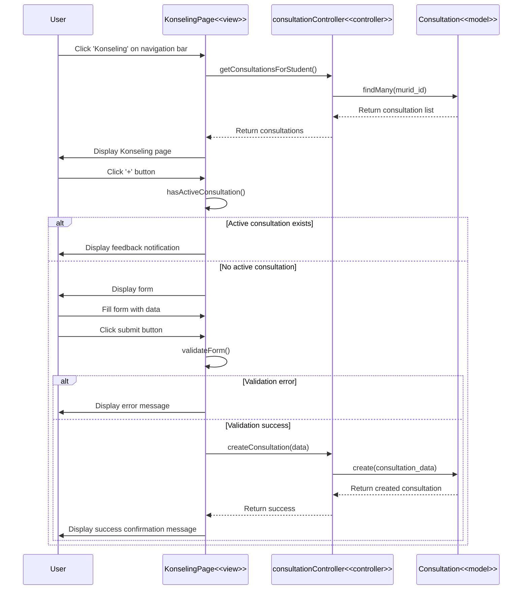

# Membuat Jadwal Konsultasi - Code Flow Documentation

## Overview

This document describes the code flow for the "Membuat Jadwal Konsultasi" (Create Consultation Schedule) feature. The flow allows students to schedule consultation sessions with academic advisors/counselors by selecting date, time, and providing consultation details.

## Activity Diagram Flow

1. User accesses EDUPATH main page → System displays homepage
2. User clicks 'Konseling' on navigation bar → System displays Konseling page
3. User clicks '+' button (create schedule)
4. System validates that no active consultation session exists
5. **[No active session]** → System displays consultation schedule creation form
6. **[Active session exists]** → System displays feedback notification about active consultation
7. User fills form with appropriate data
8. User presses save/submit button
9. System validates input fields
10. **[Validation error]** → System displays error message
11. **[Valid]** → System adds consultation schedule to database → System displays success confirmation message

## Technical Stack

- **Frontend**: React + TypeScript, React Router, Axios, React Hook Form, Yup
- **Backend**: Express.js, Prisma ORM
- **Database**: PostgreSQL
- **Validation**: Yup schema validation
- **UI Components**: Shadcn UI (Calendar, Popover)
- **Date Handling**: date-fns

## Architecture Components

### Frontend Pages

1. **Konseling Page** (`client/src/pages/user/Konseling/index.tsx`)

   - Display consultation list and information
   - Handle modal trigger
   - Validate active consultation status
   - Fetch consultations

2. **ModalJadwalkanKonseling Component** (`client/src/pages/user/Konseling/components/ModalJadwalkanKonseling.tsx`)
   - Display consultation schedule form
   - Handle date and time selection
   - Validate form inputs
   - Submit consultation data
   - Fetch available admins
   - Fetch booked time slots

### Backend Components

1. **Consultation Controller** (`server/src/controllers/consultationController.ts`)
   - `createConsultation()` - Create new consultation schedule
   - `getConsultationsForStudent()` - Get student's consultations
   - `checkScheduleConflict()` - Validate schedule conflicts

### Database Models

- **Consultation** - Consultation schedules with student, admin, date, time, status
- **User** - User data for students and admins

## Sequence Diagram



## Data Flow Details

### 1. Active Consultation Check

**Frontend Validation**:

```typescript
// Check if user has any active consultation
const hasActiveConsultation = consultations.some((c) => c.is_active);

const handleOpenModal = () => {
  if (hasActiveConsultation) {
    toast.error(
      "Anda masih memiliki konsultasi yang sedang aktif. Harap selesaikan konsultasi tersebut terlebih dahulu."
    );
    return;
  }
  setShowModal(true);
};
```

**Backend Validation**:

```typescript
const activeConsultation = await prisma.consultation.findFirst({
  where: {
    murid_id,
    is_active: true,
    status: {
      in: [ConsultationStatus.PENDING, ConsultationStatus.ACCEPTED],
    },
  },
});

if (activeConsultation) {
  return res.status(400).json({
    success: false,
    message: "Anda masih memiliki konsultasi yang sedang aktif...",
  });
}
```

### 2. Form Validation

**Yup Schema**:

```typescript
const konselingSchema = yup.object({
  selectedDate: yup.date().required("Tanggal harus dipilih"),
  selectedTimeStart: yup.string().required("Waktu mulai harus dipilih"),
  selectedTimeEnd: yup.string().required("Waktu selesai harus dipilih"),
  message: yup.string().required("Topik harus diisi"),
  description: yup.string().required("Deskripsi harus diisi"),
  expertName: yup.string().required("Konselor harus dipilih"),
});
```

### 3. Booked Slots Check

**Fetch Booked Slots**:

```typescript
const fetchBookedSlots = async (date: Date, adminId: string) => {
  const dateStr = format(date, "yyyy-MM-dd");
  const response = await axios.get(
    `${API_URL}/api/consultations/booked-slots`,
    {
      params: { date: dateStr, admin_id: adminId },
      headers: { Authorization: `Bearer ${token}` },
    }
  );

  // Convert booked consultations to 30-minute time slots
  const bookedTimes: string[] = [];
  response.data.data.forEach((consultation) => {
    const { start_time, end_time } = consultation;
    // Add all 30-minute slots from start to end
    let currentTime = start_time;
    while (currentTime < end_time) {
      bookedTimes.push(currentTime);
      currentTime = addMinutes(currentTime, 30);
    }
  });

  setBookedSlots(bookedTimes);
};
```

### 4. Consultation Data Structure

```typescript
interface Consultation {
  consultation_id: string;
  murid_id: string;
  admin_id: string;
  topic: string;
  consultation_date: string; // ISO 8601 with timezone
  description?: string;
  status: "PENDING" | "ACCEPTED" | "DECLINED" | "COMPLETED";
  is_active: boolean;
  created_at: string;
  updated_at: string;
}

interface ConsultationRequest {
  murid_id: string;
  admin_id: string;
  topic: string;
  consultation_date: string; // "YYYY-MM-DDTHH:mm:ss+07:00"
  description: string;
}
```

### 5. Time Slot Generation

```typescript
// Generate time slots from 8:00 to 17:00 (30-minute intervals)
const generateTimeSlots = () => {
  const slots = [];
  for (let hour = 8; hour <= 17; hour++) {
    slots.push(`${hour.toString().padStart(2, "0")}:00`);
    if (hour < 17) {
      slots.push(`${hour.toString().padStart(2, "0")}:30`);
    }
  }
  return slots;
};
// Result: ["08:00", "08:30", "09:00", ..., "17:00"]
```

## API Endpoints

### POST `/api/consultations`

**Purpose**: Create new consultation schedule

**Authorization**: JWT token required

**Request Body**:

```json
{
  "murid_id": "user123",
  "admin_id": "admin456",
  "topic": "Konsultasi Pemilihan Jurusan",
  "consultation_date": "2024-01-20T10:00:00+07:00",
  "description": "Saya ingin berkonsultasi tentang pemilihan jurusan yang sesuai dengan minat dan bakat saya"
}
```

**Response Success (201)**:

```json
{
  "success": true,
  "message": "Konseling berhasil dibuat",
  "data": {
    "consultation_id": "CONS-2024-001",
    "murid_id": "user123",
    "admin_id": "admin456",
    "topic": "Konsultasi Pemilihan Jurusan",
    "consultation_date": "2024-01-20T10:00:00.000Z",
    "description": "Saya ingin berkonsultasi...",
    "status": "PENDING",
    "is_active": true,
    "created_at": "2024-01-15T08:30:00.000Z",
    "murid": {
      "user_id": "user123",
      "firstname": "John",
      "lastname": "Doe",
      "email": "john@example.com",
      "kelas": 12
    },
    "admin": {
      "user_id": "admin456",
      "firstname": "Jane",
      "lastname": "Smith",
      "email": "jane@example.com"
    }
  }
}
```

**Response Error (400 - Active Consultation)**:

```json
{
  "success": false,
  "message": "Anda masih memiliki konsultasi yang sedang aktif. Harap selesaikan konsultasi tersebut terlebih dahulu."
}
```

**Response Error (409 - Schedule Conflict)**:

```json
{
  "success": false,
  "message": "Jadwal konseling bentrok dengan konseling lain. Silakan pilih waktu yang berbeda."
}
```

**Response Error (400 - Validation)**:

```json
{
  "success": false,
  "message": "Murid ID, Admin ID, topic, dan tanggal konseling wajib diisi"
}
```

### GET `/api/consultations`

**Purpose**: Get all consultations for current student

**Authorization**: JWT token required

**Response Success (200)**:

```json
{
  "success": true,
  "data": [
    {
      "consultation_id": "CONS-2024-001",
      "topic": "Konsultasi Pemilihan Jurusan",
      "consultation_date": "2024-01-20T10:00:00.000Z",
      "status": "PENDING",
      "is_active": true,
      "created_at": "2024-01-15T08:30:00.000Z"
    }
  ]
}
```

### GET `/api/consultations/booked-slots`

**Purpose**: Get booked time slots for specific date and admin

**Authorization**: JWT token required

**Query Parameters**:

- `date` - Date in YYYY-MM-DD format
- `admin_id` - Admin user ID

**Response Success (200)**:

```json
{
  "success": true,
  "data": [
    {
      "consultation_id": "CONS-2024-001",
      "start_time": "10:00",
      "end_time": "11:00",
      "admin_id": "admin456"
    }
  ]
}
```

### GET `/api/users/admins`

**Purpose**: Get list of all admin users

**Authorization**: JWT token required

**Response Success (200)**:

```json
{
  "success": true,
  "data": [
    {
      "user_id": "admin456",
      "firstname": "Jane",
      "lastname": "Smith",
      "email": "jane@example.com",
      "role": "ADMIN"
    }
  ]
}
```

## Key Features

### 1. Active Consultation Prevention

**Frontend Check**:

- Check `is_active` flag in consultations list
- Disable modal trigger if active consultation exists
- Show error toast notification

**Backend Validation**:

- Query database for active consultations (PENDING or ACCEPTED status)
- Return 400 error if active consultation found
- Prevent duplicate active consultations

### 2. Schedule Conflict Detection

**Conflict Check Logic**:

```typescript
const checkScheduleConflict = async (consultationDate: Date) => {
  const consultationStart = consultationDate;
  const consultationEnd = new Date(consultationDate.getTime() + 60 * 60 * 1000); // +1 hour

  const conflictingConsultations = await prisma.consultation.findMany({
    where: {
      AND: [
        { consultation_date: { lt: consultationEnd } },
        { consultation_date: { gte: consultationStart } },
        { status: { in: ["PENDING", "ACCEPTED"] } },
      ],
    },
  });

  return conflictingConsultations.length > 0;
};
```

### 3. Date and Time Validation

**Frontend Validation**:

- Disable past dates in calendar
- Disable past time slots for current day
- Disable already booked time slots
- Show fully booked dates in calendar

**Backend Validation**:

- Verify consultation date is at least 5 minutes in future
- Use Indonesia timezone (WIB - UTC+7) for consistency
- Validate date format (ISO 8601)

### 4. Dynamic Time Slot Management

**Features**:

- 30-minute time intervals (08:00 - 17:00)
- Real-time booked slot fetching
- Visual indication of unavailable slots
- Automatic end time calculation (start time + 1 hour)

### 5. Form State Management

**State Variables**:

```typescript
const [selectedDate, setSelectedDate] = useState<Date>();
const [selectedTimeStart, setSelectedTimeStart] = useState<string>("");
const [selectedTimeEnd, setSelectedTimeEnd] = useState<string>("");
const [formData, setFormData] = useState({
  message: "",
  expertName: "",
  description: "",
});
const [errors, setErrors] = useState<Record<string, string>>({});
const [bookedSlots, setBookedSlots] = useState<string[]>([]);
```

## User Experience Flow

1. **Access Page** → User clicks 'Konseling' on navigation
2. **View Consultations** → System displays consultation list
3. **Click Create** → User clicks '+' button
4. **Active Check** → System validates no active consultation
5. **Open Form** → Modal displays schedule creation form
6. **Load Admins** → System fetches available counselors
7. **Select Date** → User picks consultation date from calendar
8. **Fetch Slots** → System retrieves booked time slots
9. **Select Time** → User selects available time slot
10. **Fill Details** → User enters topic and description
11. **Submit** → User clicks submit button
12. **Validate** → System validates all inputs
13. **Create** → System creates consultation in database
14. **Confirm** → User sees success message and updated list

## Error States

### Frontend Validation Errors

1. **Missing Date**: "Tanggal harus dipilih"
2. **Missing Time**: "Waktu mulai harus dipilih"
3. **Missing Topic**: "Topik harus diisi"
4. **Missing Description**: "Deskripsi harus diisi"
5. **Missing Counselor**: "Konselor harus dipilih"

### Backend Errors

1. **Active Consultation (400)**:

   - Message: "Anda masih memiliki konsultasi yang sedang aktif"
   - Action: Close modal, user must complete existing consultation

2. **Schedule Conflict (409)**:

   - Message: "Jadwal konseling bentrok dengan konseling lain"
   - Action: User selects different time slot

3. **Invalid Date (400)**:

   - Message: "Tanggal konseling harus minimal 5 menit dari sekarang"
   - Action: User selects future date/time

4. **Student Not Found (400)**:

   - Message: "Murid tidak ditemukan"
   - Action: Re-authentication required

5. **Admin Not Found (400)**:
   - Message: "Admin tidak ditemukan"
   - Action: Refresh admin list

## Performance Optimizations

1. **Lazy Loading**: Modal component loaded only when needed
2. **Debounced Fetching**: Booked slots fetched only when date/admin changes
3. **Cached Admin List**: Admin data fetched once and cached
4. **Optimistic UI**: Form resets immediately after successful submission
5. **Timezone Handling**: Indonesia timezone (WIB) used consistently

## Database Queries

### Check Active Consultation

```typescript
const activeConsultation = await prisma.consultation.findFirst({
  where: {
    murid_id,
    is_active: true,
    status: {
      in: [ConsultationStatus.PENDING, ConsultationStatus.ACCEPTED],
    },
  },
});
```

### Create Consultation

```typescript
const consultation = await prisma.consultation.create({
  data: {
    consultation_id: customId,
    murid_id,
    admin_id,
    topic,
    consultation_date: consultationDate,
    description,
  },
  include: {
    murid: {
      select: {
        user_id: true,
        firstname: true,
        lastname: true,
        email: true,
        kelas: true,
      },
    },
    admin: {
      select: {
        user_id: true,
        firstname: true,
        lastname: true,
        email: true,
      },
    },
  },
});
```

### Get Booked Slots

```typescript
const bookedConsultations = await prisma.consultation.findMany({
  where: {
    admin_id,
    consultation_date: {
      gte: startOfDay,
      lt: endOfDay,
    },
    status: {
      in: [ConsultationStatus.PENDING, ConsultationStatus.ACCEPTED],
    },
  },
  select: {
    consultation_date: true,
  },
});
```

---

**Last Updated**: 2024-01-15  
**Version**: 1.0  
**Related Diagrams**: Activity Diagram - Membuat Jadwal Konsultasi  
**Related Documentation**: TES_MINAT_BAKAT_CODE_FLOW.md, LIHAT_HASIL_TES_CODE_FLOW.md
