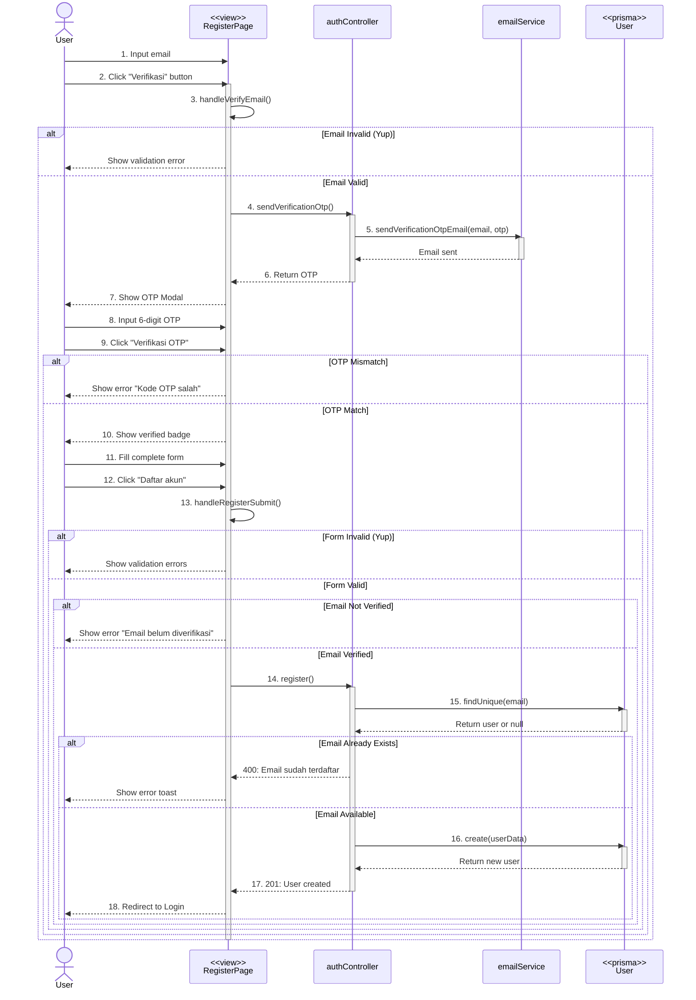

# REGISTER FLOW - Complete Documentation

## 📋 Overview

Dokumentasi lengkap alur register dari user input sampai redirect ke halaman login.

---

## 🎭 Mermaid Sequence Diagram



---

## 🎯 Flow Diagram Summary

```
User Input (View)
    ↓
Frontend Validation (Yup Schema)
    ↓
Email Verification Flow
    ↓
    ├── API Request (POST /api/auth/send-verification-otp)
    ├── Backend Router (authRoutes.ts)
    ├── Controller (authController.sendVerificationOtp)
    ├── Email Service (sendVerificationOtpEmail)
    ├── OTP Modal (User Input)
    └── OTP Verification (Frontend)
    ↓
Complete Form Input
    ↓
Frontend Validation (Yup Schema)
    ↓
API Request (POST /api/auth/register)
    ↓
Backend Router (authRoutes.ts)
    ↓
Controller (authController.register)
    ↓
Check Existing User (Prisma - User)
    ↓
Password Hashing (bcrypt.hash)
    ↓
Generate Custom User ID
    ↓
Create User (Prisma - User)
    ↓
Response to Frontend
    ↓
Redirect to Login
```

---

## 📝 Detailed Step-by-Step Flow

### **PHASE 1: Email Verification**

#### **STEP 1: User Input Email (Frontend View)**

**File:** `client/src/pages/auth/Register.tsx`

```typescript
// User mengisi email
<AuthEmailInput
  placeholder="Email"
  value={email}
  onChange={(e) => setEmail(e.target.value)}
  error={errors.email}
  isVerified={isVerified}
  onVerify={handleVerifyEmail}
  verifyButtonText="Verifikasi"
/>
```

**State yang digunakan:**

- `email`: string
- `isVerified`: boolean
- `errors`: { [key: string]: string }

---

#### **STEP 2: Email Validation (Frontend)**

**File:** `client/src/pages/auth/Register.tsx` (handleVerifyEmail function)

```typescript
const handleVerifyEmail = async () => {
  try {
    // Validasi pakai yup
    await emailSchema.validate({ email });

    // Jika valid, kirim OTP...
  } catch (err: any) {
    if (err instanceof yup.ValidationError) {
      setErrors((prev) => ({
        ...prev,
        email: err.message,
      }));
    }
  }
};
```

**Validation Schema:** `client/src/schema/RegisterSchema.tsx`

```typescript
export const emailSchema = yup.object().shape({
  email: yup.string().email("Email tidak valid").required("Email wajib diisi"),
});
```

**Output:**

- ✅ Valid → Lanjut ke Step 3
- ❌ Invalid → Show error message, stop execution

---

#### **STEP 3: Send OTP Request**

**File:** `client/src/pages/auth/Register.tsx`

```typescript
const response = await axios.post(`${API_URL}/api/auth/send-verification-otp`, {
  email,
});

const serverOtp = response.data.otp;
setOtp(serverOtp);
setShowModal(true);
```

**Request Details:**

- **Method:** POST
- **URL:** `http://localhost:5000/api/auth/send-verification-otp`
- **Headers:**
  ```
  Content-Type: application/json
  ```
- **Body:**
  ```json
  {
    "email": "user@example.com"
  }
  ```

---

#### **STEP 4: Backend - Send OTP**

**File:** `server/src/controllers/authController.ts`

##### **4.1 Generate OTP**

```typescript
async sendVerificationOtp(req: Request, res: Response): Promise<void> {
  try {
    const { email } = req.body;

    // Generate OTP (6 digit)
    const otp = Math.floor(100000 + Math.random() * 900000).toString();
```

**OTP Format:**

- 6 digit random number
- Example: `123456`, `789012`

**Note:** Email validation sudah dilakukan di frontend dengan Yup schema, jadi backend tidak perlu validasi ulang.

##### **4.2 Send Email**

```typescript
await sendVerificationOtpEmail(email, otp);
```

**Email Service:** `server/src/services/emailService.ts`

- Use Nodemailer
- HTML template with OTP code
- Subject: "Verifikasi Email Anda - EduPath"

##### **4.3 Return OTP**

```typescript
res.status(200).json({
  success: true,
  otp,
  message: "Kode verifikasi berhasil dikirim ke email",
});
```

**Response:**

```json
{
  "success": true,
  "otp": "123456",
  "message": "Kode verifikasi berhasil dikirim ke email"
}
```

---

#### **STEP 5: OTP Modal (Frontend)**

**File:** `client/src/pages/auth/Register.tsx`

```typescript
{
  showModal && (
    <OtpModal
      key={otp}
      email={email}
      otp={otp}
      onClose={() => setShowModal(false)}
      onVerifySuccess={() => {
        setIsVerified(true);
        setShowModal(false);
      }}
      onResend={handleResendOtp}
      resetTrigger={otpResetTrigger}
    />
  );
}
```

**OTP Modal Component:** `client/src/pages/auth/components/ModalVerifyOtp.tsx`

- 6 input boxes for OTP digits
- Auto-focus next input on type
- Countdown timer (30 seconds)
- Resend OTP button

---

#### **STEP 6: OTP Verification (Frontend)**

**OTP Validation Logic:**

```typescript
// User menginput 6 digit OTP
const userOtp = otp1 + otp2 + otp3 + otp4 + otp5 + otp6;

// Compare dengan OTP dari server
if (userOtp === serverOtp) {
  onVerifySuccess();
  toast.success("Email berhasil diverifikasi!");
} else {
  toast.error("Kode OTP salah");
}
```

**Output:**

- ✅ Match → Set `isVerified = true`, close modal
- ❌ Not Match → Show error, keep modal open

---

### **PHASE 2: Complete Registration**

#### **STEP 7: User Fill Complete Form**

**File:** `client/src/pages/auth/Register.tsx`

```typescript
// Form fields
<AuthInput placeholder="Nama awal" value={firstName} />
<AuthInput placeholder="Nama akhir" value={lastName} />
<DropdownList placeholder="Kelas" value={kelas} />
<AuthEmailInput placeholder="Email" isVerified={isVerified} />
<AuthPasswordInput placeholder="Password" value={password} />
<AuthPasswordInput placeholder="Konfirmasi Password" value={confirmPassword} />
```

**State yang digunakan:**

- `firstName`: string
- `lastName`: string
- `kelas`: { value: string, label: string }
- `email`: string (already verified)
- `password`: string
- `confirmPassword`: string

---

#### **STEP 8: Form Validation (Frontend)**

**File:** `client/src/pages/auth/Register.tsx` (handleRegisterSubmit function)

```typescript
const handleRegisterSubmit = async () => {
  setErrors({});

  const formData = {
    firstName,
    lastName,
    kelas: kelas?.value ?? "",
    email,
    password,
    confirmPassword,
  };

  try {
    await registerSchema.validate(formData, { abortEarly: false });
    // Jika validasi lolos, lanjut ke API...
  } catch (err: any) {
    if (err.name === "ValidationError") {
      // Handle validation errors
      const newErrors = {};
      err.inner.forEach((e) => {
        newErrors[e.path] = e.message;
      });
      setErrors(newErrors);
      return;
    }
  }
};
```

**Validation Schema:** `client/src/schema/RegisterSchema.tsx`

```typescript
export const registerSchema = yup.object().shape({
  firstName: yup.string().required("Nama awal wajib diisi"),
  lastName: yup.string().required("Nama akhir wajib diisi"),
  kelas: yup.string().required("Kelas wajib diisi"),
  email: yup.string().email("Email tidak valid").required("Email wajib diisi"),
  password: yup
    .string()
    .min(6, "Password minimal 6 karakter")
    .required("Password wajib diisi"),
  confirmPassword: yup
    .string()
    .oneOf([yup.ref("password")], "Password tidak cocok")
    .required("Konfirmasi password wajib diisi"),
});
```

**Output:**

- ✅ Valid → Lanjut ke Step 9
- ❌ Invalid → Show error messages, stop execution

---

#### **STEP 9: Check Email Verification**

```typescript
if (!isVerified) {
  setErrors((prev) => ({
    ...prev,
    email: "Email belum diverifikasi",
  }));
  return;
}
```

**Purpose:**

- Pastikan email sudah diverifikasi sebelum register
- Mencegah register tanpa verifikasi email

---

#### **STEP 10: API Request - Register**

**File:** `client/src/pages/auth/Register.tsx`

```typescript
await axios.post(`${API_URL}/api/auth/register`, {
  firstname: firstName,
  lastname: lastName,
  kelas: Number(kelas?.value),
  email,
  password,
});
```

**Request Details:**

- **Method:** POST
- **URL:** `http://localhost:5000/api/auth/register`
- **Headers:**
  ```
  Content-Type: application/json
  ```
- **Body:**
  ```json
  {
    "firstname": "John",
    "lastname": "Doe",
    "kelas": 12,
    "email": "john@example.com",
    "password": "password123"
  }
  ```

---

#### **STEP 11: Backend Router**

**File:** `server/src/routes/authRoutes.ts`

```typescript
import { Router } from "express";
import { AuthController } from "../controllers/authController";

const router = Router();
const controller = new AuthController();

router.post("/register", controller.register.bind(controller));
```

---

#### **STEP 12: Controller - Register Logic**

**File:** `server/src/controllers/authController.ts`

##### **12.1 Check Existing User**

```typescript
async register(req: Request, res: Response): Promise<void> {
  try {
    const existingUser = await prisma.user.findUnique({
      where: { email: req.body.email.toLowerCase() },
    });

    if (existingUser) {
      res.status(400).json({
        success: false,
        message: "Email sudah terdaftar",
      });
      return;
    }
```

**Prisma Query:**

- Cari user berdasarkan email (case-insensitive)
- Jika sudah ada → Return 400 Bad Request

##### **12.2 Hash Password**

```typescript
const hashed = await bcrypt.hash(req.body.password, 10);
```

**bcrypt.hash():**

- Hash password dengan salt rounds = 10
- Output: hashed password string
- Example: `$2b$10$abcdefghijklmnopqrstuvwxyz...`

##### **12.3 Generate Custom User ID**

```typescript
const customId = await this.generateCustomUserId();
```

**generateCustomUserId() function:**

```typescript
private async generateCustomUserId(): Promise<string> {
  const lastUser = await prisma.user.findFirst({
    orderBy: { user_id: "desc" },
    where: {
      user_id: {
        startsWith: "US",
      },
    },
  });

  let lastNumber = 0;

  if (lastUser) {
    const numPart = parseInt(lastUser.user_id.replace("US", ""));
    lastNumber = isNaN(numPart) ? 0 : numPart;
  }

  const nextNumber = lastNumber + 1;
  return `US${String(nextNumber).padStart(3, "0")}`;
}
```

**User ID Format:**

- Pattern: `US` + 3-digit number
- Example: `US001`, `US002`, `US010`, `US100`
- Auto-increment based on last user

##### **12.4 Create User**

```typescript
const user = await prisma.user.create({
  data: {
    user_id: customId,
    firstname: req.body.firstname,
    lastname: req.body.lastname,
    email: req.body.email,
    role: "STUDENT" as const,
    kelas: Number(req.body.kelas),
    password: hashed,
  },
});
```

**User Data:**

- `user_id`: Custom ID (US001, US002, etc.)
- `firstname`: User's first name
- `lastname`: User's last name
- `email`: User's email (lowercase)
- `role`: Fixed as "STUDENT"
- `kelas`: Grade level (10, 11, or 12)
- `password`: Hashed password

##### **12.5 Send Response**

```typescript
res.status(201).json({
  success: true,
  data: user,
  message: "Berhasil register",
});
```

**Response Structure:**

```json
{
  "success": true,
  "data": {
    "user_id": "US001",
    "email": "john@example.com",
    "firstname": "John",
    "lastname": "Doe",
    "role": "STUDENT",
    "kelas": 12
  },
  "message": "Berhasil register"
}
```

---

#### **STEP 13: Frontend Receives Response**

**File:** `client/src/pages/auth/Register.tsx`

```typescript
await axios.post(`${API_URL}/api/auth/register`, {
  // ... data
});

toast.success("Register berhasil!");
navigate("/login");
```

**Response Handling:**

- Success (201) → Show success toast & redirect to login
- Error (400) → Show error toast (Email sudah terdaftar)

---

#### **STEP 14: Redirect to Login**

```typescript
navigate("/login");
```

**React Router:**

- `useNavigate()` hook untuk programmatic navigation
- User diarahkan ke halaman login
- User bisa langsung login dengan akun baru

---

## 🔒 Security Features

### **1. Email Verification**

```typescript
// OTP digenerate random 6 digit
const otp = Math.floor(100000 + Math.random() * 900000).toString();

// OTP dikirim via email
await sendVerificationOtpEmail(email, otp);

// Frontend verify OTP sebelum allow register
if (!isVerified) {
  return; // Block registration
}
```

### **2. Password Hashing**

```typescript
// Hash password dengan bcrypt (salt rounds = 10)
const hashed = await bcrypt.hash(password, 10);

// Store hashed password di database (NEVER plain text)
password: hashed;
```

### **3. Unique Email Validation**

```typescript
// Check apakah email sudah terdaftar
const existingUser = await prisma.user.findUnique({
  where: { email: email.toLowerCase() },
});

if (existingUser) {
  return res.status(400).json({
    message: "Email sudah terdaftar",
  });
}
```

### **4. Case-Insensitive Email**

```typescript
// Email always converted to lowercase
where: {
  email: email.toLowerCase();
}
```

### **5. Custom User ID Generation**

```typescript
// Auto-increment custom ID (US001, US002, ...)
// Mencegah duplicate ID
const customId = await this.generateCustomUserId();
```

---

## ⚠️ Error Handling

### **Frontend Errors:**

#### **1. Validation Errors**

```typescript
catch (err: any) {
  if (err.name === "ValidationError") {
    const newErrors = {};
    err.inner.forEach((e) => {
      newErrors[e.path] = e.message;
    });
    setErrors(newErrors); // Show di form input
  }
}
```

#### **2. Email Not Verified**

```typescript
if (!isVerified) {
  setErrors((prev) => ({
    ...prev,
    email: "Email belum diverifikasi",
  }));
  toast.error("Silakan verifikasi email terlebih dahulu");
}
```

#### **3. Server Errors**

```typescript
catch (err: any) {
  const errorMsg = err.response?.data?.message || "Terjadi kesalahan server";
  toast.error(errorMsg);
}
```

### **Backend Errors:**

#### **1. Email Already Registered (400)**

```typescript
if (existingUser) {
  res.status(400).json({
    success: false,
    message: "Email sudah terdaftar",
  });
}
```

#### **2. Email Send Failed (500)**

````

```typescript
catch (error: any) {
  res.status(500).json({
    success: false,
    message: "Gagal mengirim OTP",
  });
}
````

---

## 📊 Data Flow Diagram

```
┌─────────────┐
│   USER      │
│  (Browser)  │
└──────┬──────┘
       │ 1. Input email
       │ 2. Click "Verifikasi"
       ↓
┌──────────────────────┐
│   Register.tsx       │
│  - handleVerifyEmail │
└──────┬───────────────┘
       │ 3. Validate email
       ↓
┌──────────────────────┐
│  RegisterSchema.tsx  │
│  - Email validation  │
└──────┬───────────────┘
       │ 4. POST /api/auth/send-verification-otp
       ↓
┌──────────────────────┐
│   authRoutes.ts      │
└──────┬───────────────┘
       │ 5. Forward to controller
       ↓
┌──────────────────────┐
│  authController.ts   │
│  - sendVerificationOtp│
└──────┬───────────────┘
       │ 6. Generate OTP
       │ 7. Send email
       ↓
┌──────────────────────┐
│   emailService.ts    │
│  - sendVerificationOtpEmail│
└──────┬───────────────┘
       │ 8. Return OTP
       ↓
┌──────────────────────┐
│   Register.tsx       │
│  - Show OTP Modal    │
└──────┬───────────────┘
       │ 9. User input OTP
       ↓
┌──────────────────────┐
│   OtpModal.tsx       │
│  - Verify OTP        │
└──────┬───────────────┘
       │ 10. OTP match → setVerified(true)
       ↓
┌──────────────────────┐
│   Register.tsx       │
│  - User fill form    │
│  - Click "Daftar"    │
└──────┬───────────────┘
       │ 11. Validate complete form
       ↓
┌──────────────────────┐
│  RegisterSchema.tsx  │
│  - Full validation   │
└──────┬───────────────┘
       │ 12. POST /api/auth/register
       ↓
┌──────────────────────┐
│   authRoutes.ts      │
└──────┬───────────────┘
       │ 13. Forward to controller
       ↓
┌──────────────────────┐
│  authController.ts   │
│  - register()        │
└──────┬───────────────┘
       │ 14. Check existing user
       ↓
┌──────────────────────┐
│   Prisma Client      │
│  - findUnique()      │
└──────┬───────────────┘
       │ 15. User not exists → continue
       ↓
┌──────────────────────┐
│  authController.ts   │
│  - bcrypt.hash()     │
│  - generateUserId()  │
└──────┬───────────────┘
       │ 16. Create user
       ↓
┌──────────────────────┐
│   Prisma Client      │
│  - create()          │
└──────┬───────────────┘
       │ 17. Return new user
       ↓
┌──────────────────────┐
│   Register.tsx       │
│  - Show success      │
└──────┬───────────────┘
       │ 18. Navigate to /login
       ↓
┌──────────────────────┐
│   Login.tsx          │
└──────────────────────┘
```

---

## 🔑 Key Components

### **Frontend:**

1. **Register.tsx** - Main register page component
2. **RegisterSchema.tsx** - Yup validation schemas (email & full form)
3. **OtpModal.tsx** - OTP input modal component
4. **AuthLayout.tsx** - Layout wrapper untuk auth pages
5. **AuthInput.tsx** - Reusable input component
6. **AuthEmailInput.tsx** - Email input dengan verify button
7. **AuthPasswordInput.tsx** - Password input dengan show/hide
8. **AuthButton.tsx** - Reusable button component
9. **DropdownList.tsx** - Dropdown untuk pilih kelas

### **Backend:**

1. **authRoutes.ts** - Route definitions
2. **authController.ts** - Business logic (register & sendVerificationOtp)
3. **emailService.ts** - Email sending service
4. **prisma.ts** - Database client

### **Libraries:**

- **axios** - HTTP client
- **yup** - Validation
- **react-hot-toast** - Notifications
- **bcrypt** - Password hashing
- **nodemailer** - Email service
- **prisma** - ORM database

---

## 📦 LocalStorage Structure After Register

**Note:** Register TIDAK menyimpan data ke localStorage
User diarahkan ke login page untuk login manual

---

## 🚀 Success Response Example

### **Send OTP Response:**

```json
{
  "success": true,
  "otp": "123456",
  "message": "Kode verifikasi berhasil dikirim ke email"
}
```

### **Register Response:**

```json
{
  "success": true,
  "data": {
    "user_id": "US001",
    "email": "john@example.com",
    "firstname": "John",
    "lastname": "Doe",
    "role": "STUDENT",
    "kelas": 12
  },
  "message": "Berhasil register"
}
```

---

## ❌ Error Response Examples

### **Validation Error (Frontend):**

```javascript
{
  firstName: "Nama awal wajib diisi",
  password: "Password minimal 6 karakter",
  confirmPassword: "Password tidak cocok"
}
```

### **Email Not Verified:**

```javascript
{
  email: "Email belum diverifikasi";
}
```

### **Email Already Registered (Backend 400):**

```json
{
  "success": false,
  "message": "Email sudah terdaftar"
}
```

### **OTP Send Failed (Backend 500):**

```json
{
  "success": false,
  "message": "Gagal mengirim OTP"
}
```

---

## 🎬 Complete Timeline

### **Phase 1: Email Verification**

1. **T+0ms** - User input email
2. **T+10ms** - Click "Verifikasi" button
3. **T+15ms** - Frontend email validation
4. **T+20ms** - API request sent (send OTP)
5. **T+150ms** - Backend receives request
6. **T+155ms** - Generate OTP
7. **T+200ms** - Send email via Nodemailer
8. **T+2000ms** - Email delivered
9. **T+2050ms** - Response sent to frontend
10. **T+2100ms** - Show OTP modal
11. **T+5000ms** - User input OTP
12. **T+5010ms** - Verify OTP (frontend)
13. **T+5020ms** - Email verified, close modal

**Email Verification Time:** ~5 seconds

### **Phase 2: Complete Registration**

14. **T+10000ms** - User fill complete form
15. **T+15000ms** - Click "Daftar akun" button
16. **T+15010ms** - Frontend validation
17. **T+15020ms** - API request sent (register)
18. **T+15150ms** - Backend receives request
19. **T+15155ms** - Check existing user
20. **T+15200ms** - Hash password
21. **T+15250ms** - Generate user ID
22. **T+15260ms** - Create user in database
23. **T+15300ms** - Response sent to frontend
24. **T+15350ms** - Show success toast
25. **T+15360ms** - Navigate to login

**Registration Time:** ~350ms

**Total Time:** ~15 seconds (including user input time)

---

## 📝 Notes

- **Email verification required:** User MUST verify email sebelum bisa register
- **OTP expiry:** 30 seconds (countdown timer)
- **OTP resend:** Available after countdown selesai
- **Password min length:** 6 karakter
- **Email:** Case-insensitive, auto lowercase
- **Role:** Fixed as "STUDENT" (not configurable saat register)
- **User ID format:** US + 3-digit auto-increment (US001, US002, ...)
- **Kelas options:** 10, 11, 12
- **After register:** Redirect to login page (no auto-login)
- **Security:** bcrypt hashing + email verification
- **Error handling:** Frontend & backend validation
- **Toast notifications:** Success & error messages
