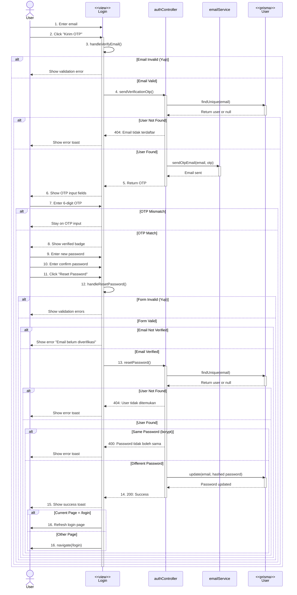

# RESET PASSWORD FLOW - Complete Documentation

## 📋 Overview

Dokumentasi lengkap alur reset password dengan verifikasi OTP email.

---

## 🎭 Mermaid Sequence Diagram



---

## 🎯 Flow Diagram Summary

```
User Click "Lupa Password?"
    ↓
Login Page - Open Reset Password Modal
    ↓
Enter Email
    ↓
Click "Kirim OTP"
    ↓
Validate Email (Yup)
    ↓
sendVerificationOtp()
    ↓
Backend: Check user exists
    ↓
    ├── User not found → Error 404
    └── User exists
            ↓
            Generate 6-digit OTP
            ↓
            Send email via EmailService
            ↓
            Return OTP to frontend
            ↓
User receives email
    ↓
Enter 6-digit OTP (auto-verify)
    ↓
    ├── OTP match → Enable password fields
    └── OTP not match → Stay disabled
    ↓
Enter New Password & Confirm Password
    ↓
Click "Reset Password"
    ↓
Validate Passwords (Yup)
    ↓
resetPassword()
    ↓
Backend: Check user exists
    ↓
Compare new password with old password
    ↓
    ├── Same password → Error 400
    └── Different password
            ↓
            Hash password (bcrypt)
            ↓
            Update user password in DB
            ↓
            Return success 200
            ↓
Frontend: Clear localStorage
    ↓
Show success toast
    ↓
Close modal after 2.5s
    ↓
Redirect to /login
```

---

## 📝 Detailed Step-by-Step Flow

### **STEP 1: User Click "Lupa Password?"**

**Location:** Login page

**File:** `client/src/pages/auth/Login.tsx`

```tsx
<button
  onClick={() => setShowResetPassword(true)}
  className="text-sm text-blue-500 hover:underline"
>
  Lupa Password?
</button>

<ModalResetPassword
  isOpen={showResetPassword}
  onClose={() => setShowResetPassword(false)}
/>
```

---

### **STEP 2-3: Enter Email & Click "Kirim OTP"**

**File:** `client/src/pages/auth/components/ModalResetPassword.tsx`

```tsx
const [email, setEmail] = useState("");

<input
  type="email"
  value={email}
  onChange={(e) => setEmail(e.target.value)}
  placeholder="Masukkan email Anda"
/>

<button onClick={handleVerifyEmail}>
  {timer > 0 ? `Kirim ulang (${timer}s)` : "Kirim OTP"}
</button>
```

---

### **STEP 4: Validate Email (Yup)**

**File:** `client/src/schema/ResetPasswordSchema.tsx`

**Validation Schema:**

```typescript
export const emailSchema = yup.object().shape({
  email: yup
    .string()
    .email("Format email tidak valid")
    .required("Email wajib diisi"),
});
```

**Frontend Code:**

```typescript
const handleVerifyEmail = async () => {
  try {
    await emailSchema.validate({ email }, { abortEarly: false });
    setErrors({});

    // Proceed to send OTP...
  } catch (err: any) {
    if (err instanceof ValidationError) {
      const emailErr: { email?: string } = {};
      err.inner.forEach((e) => {
        if (e.path === "email") emailErr.email = e.message;
      });
      setErrors((prev) => ({ ...prev, ...emailErr }));
    }
  }
};
```

**Validation Rules:**

- ✅ Email tidak boleh kosong
- ✅ Email harus format valid (example@domain.com)

---

### **STEP 5: sendVerificationOtp()**

**Backend Method:** `sendVerificationOtp()`

**Request:**

```json
{
  "email": "user@example.com",
  "type": "reset"
}
```

**Frontend Code:**

```typescript
const response = await axios.post(`${API_URL}/api/auth/send-verification-otp`, {
  email,
  type: "reset",
});

// Set OTP from server response (development only)
setServerOtp(response.data.otp);

toast.success("OTP berhasil dikirim ke email!");
startTimer(); // Start 30s cooldown
```

**Backend Controller:**

**File:** `server/src/controllers/authController.ts`

```typescript
async sendVerificationOtp(req: Request, res: Response): Promise<void> {
  const { email, type } = req.body;

  if (!email) {
    res.status(400).json({
      success: false,
      message: "Email wajib diisi",
    });
    return;
  }

  try {
    const user = await prisma.user.findUnique({
      where: { email },
    });

    if (!user) {
      res.status(404).json({
        success: false,
        message: "Email tidak terdaftar",
      });
      return;
    }

    // Generate 6-digit OTP
    const otp = Math.floor(100000 + Math.random() * 900000).toString();

    // Send OTP via email
    await emailService.sendOtpEmail(email, otp, type);

    res.status(200).json({
      success: true,
      message: "OTP berhasil dikirim",
      otp, // ONLY for development - remove in production
    });
  } catch (error: any) {
    res.status(500).json({
      success: false,
      message: error.message,
    });
  }
}
```

**Email Service:**

**File:** `server/src/services/emailService.ts`

```typescript
async sendOtpEmail(
  email: string,
  otp: string,
  type: "register" | "reset"
): Promise<void> {
  const subject = type === "register"
    ? "Email Verification - OTP Code"
    : "Reset Password - OTP Code";

  const htmlContent = `
    <div style="font-family: Arial, sans-serif; max-width: 600px; margin: 0 auto;">
      <h2>Reset Password Request</h2>
      <p>Hi there! We received a request to reset your password.</p>
      <p>Your OTP code is:</p>
      <div style="background-color: #f0f0f0; padding: 15px; text-align: center; font-size: 32px; font-weight: bold;">
        ${otp}
      </div>
      <p>This code will expire in 10 minutes.</p>
    </div>
  `;

  await this.transporter.sendMail({
    from: process.env.EMAIL_USER,
    to: email,
    subject,
    html: htmlContent,
  });
}
```

**Response:**

```json
{
  "success": true,
  "message": "OTP berhasil dikirim",
  "otp": "123456"
}
```

---

### **STEP 6-7: Enter OTP & Auto-Verify**

**Frontend Code:**

```typescript
const [otp, setOtp] = useState<string[]>(Array(6).fill(""));
const [serverOtp, setServerOtp] = useState("");
const [isVerified, setIsVerified] = useState(false);

const handleChangeOtp = (value: string, index: number) => {
  if (!/^\d?$/.test(value)) return; // Only digits

  const newOtp = [...otp];
  newOtp[index] = value;
  setOtp(newOtp);

  // Auto-focus next input
  if (value && index < 5) {
    inputRefs.current[index + 1]?.focus();
  }

  // Auto-verify when all 6 digits entered
  if (newOtp.every((digit) => digit !== "")) {
    const userInputOtp = newOtp.join("");
    if (userInputOtp === serverOtp) {
      setIsVerified(true);
      toast.success("Email berhasil diverifikasi!");
    } else {
      setIsVerified(false);
    }
  }
};
```

**UI Elements:**

```tsx
<div className="flex gap-2 justify-center">
  {otp.map((digit, idx) => (
    <input
      key={idx}
      ref={(el) => (inputRefs.current[idx] = el!)}
      type="text"
      maxLength={1}
      value={digit}
      onChange={(e) => handleChangeOtp(e.target.value, idx)}
      onKeyDown={(e) => handleKeyDown(e, idx)}
      className="w-12 h-12 text-center text-xl border-2 rounded-lg"
      disabled={timer === 0}
    />
  ))}
</div>;

{
  isVerified && (
    <div className="flex items-center gap-2 text-green-600">
      <CheckCircle size={20} />
      <span>Email terverifikasi!</span>
    </div>
  );
}
```

**OTP Verification Logic:**

- ✅ All 6 digits must be filled
- ✅ OTP must match server OTP
- ✅ Auto-verify on completion
- ✅ Enable password fields only after verification

---

### **STEP 8-9: Enter New Password & Confirm Password**

**Frontend Code:**

```tsx
const [newPassword, setNewPassword] = useState("");
const [confirmPassword, setConfirmPassword] = useState("");
const [showNewPassword, setShowNewPassword] = useState(false);
const [showConfirmPassword, setShowConfirmPassword] = useState(false);

<div>
  <label>Password Baru</label>
  <div className="relative">
    <input
      type={showNewPassword ? "text" : "password"}
      value={newPassword}
      onChange={(e) => setNewPassword(e.target.value)}
      disabled={!isVerified}
      placeholder="Minimal 8 karakter"
    />
    <button
      onClick={() => setShowNewPassword(!showNewPassword)}
      type="button"
    >
      {showNewPassword ? <EyeOff /> : <Eye />}
    </button>
  </div>
</div>

<div>
  <label>Konfirmasi Password</label>
  <div className="relative">
    <input
      type={showConfirmPassword ? "text" : "password"}
      value={confirmPassword}
      onChange={(e) => setConfirmPassword(e.target.value)}
      disabled={!isVerified}
      placeholder="Ketik ulang password"
    />
    <button
      onClick={() => setShowConfirmPassword(!showConfirmPassword)}
      type="button"
    >
      {showConfirmPassword ? <EyeOff /> : <Eye />}
    </button>
  </div>
</div>
```

---

### **STEP 10-11: Click "Reset Password" & Validate**

**Validation Schema:**

**File:** `client/src/schema/ResetPasswordSchema.tsx`

```typescript
export const resetPasswordSchema = (isEmailVerified: boolean) =>
  yup.object().shape({
    email: yup
      .string()
      .email("Format email tidak valid")
      .required("Email wajib diisi"),
    newPassword: yup
      .string()
      .min(8, "Password minimal 8 karakter")
      .required("Password baru wajib diisi")
      .test("is-verified", "Email belum diverifikasi", () => isEmailVerified),
    confirmPassword: yup
      .string()
      .oneOf([yup.ref("newPassword")], "Password tidak cocok")
      .required("Konfirmasi password wajib diisi"),
  });
```

**Frontend Validation:**

```typescript
const handleSubmit = async () => {
  try {
    const schema = resetPasswordSchema(isVerified);
    await schema.validate(
      { email, newPassword, confirmPassword },
      { abortEarly: false }
    );

    setErrors({});

    // Proceed to API call...
  } catch (err: any) {
    if (err instanceof ValidationError) {
      const newErrors: { [key: string]: string } = {};
      err.inner.forEach((e) => {
        if (e.path) newErrors[e.path] = e.message;
      });
      setErrors(newErrors);
    }
  }
};
```

**Validation Rules:**

- ✅ Email must be verified (OTP matched)
- ✅ New password minimal 8 characters
- ✅ Confirm password must match new password
- ✅ All fields required

---

### **STEP 12: resetPassword()**

**Backend Method:** `resetPassword()`

**Request:**

```json
{
  "email": "user@example.com",
  "otp": "123456",
  "newPassword": "newSecurePass123"
}
```

**Frontend Code:**

```typescript
await axios.post(`${API_URL}/api/auth/reset-password`, {
  email,
  otp: serverOtp,
  newPassword,
});

// Clear all auth data
localStorage.removeItem("token_data");
localStorage.removeItem("user_id");
localStorage.removeItem("role");

setSuccess(true);
toast.success("Password berhasil direset! Silakan login kembali.");

// Close modal and redirect after 2.5s
setTimeout(() => {
  onClose();

  const currentPath = window.location.pathname;
  if (currentPath !== "/login" && currentPath !== "/register") {
    window.location.href = "/login";
  }
}, 2500);
```

**Backend Controller:**

**File:** `server/src/controllers/authController.ts`

```typescript
async resetPassword(req: Request, res: Response): Promise<void> {
  const { email, otp, newPassword } = req.body;

  if (!email || !otp || !newPassword) {
    res.status(400).json({
      success: false,
      message: "Email, OTP, dan password baru wajib diisi",
    });
    return;
  }

  try {
    // 1. Find user by email
    const user = await prisma.user.findUnique({
      where: { email },
    });

    if (!user) {
      res.status(404).json({
        success: false,
        message: "User tidak ditemukan",
      });
      return;
    }

    // 2. Check if new password is same as old password
    const isSame = await bcrypt.compare(newPassword, user.password!);
    if (isSame) {
      res.status(400).json({
        success: false,
        message: "Password baru tidak boleh sama dengan password lama",
      });
      return;
    }

    // 3. Hash new password
    const hashed = await bcrypt.hash(newPassword, 10);

    // 4. Update user password
    await prisma.user.update({
      where: { email },
      data: { password: hashed },
    });

    res.status(200).json({
      success: true,
      message: "Password berhasil direset",
    });
  } catch (error: any) {
    res.status(400).json({
      success: false,
      message: error.message,
    });
  }
}
```

**Backend Logic:**

1. ✅ Validate all required fields
2. ✅ Check user exists by email
3. ✅ Compare new password with old password (prevent same password)
4. ✅ Hash new password with bcrypt (salt 10)
5. ✅ Update password in database
6. ✅ Return success response

**Response:**

```json
{
  "success": true,
  "message": "Password berhasil direset"
}
```

---

## 🔑 Key Components

### **Frontend:**

1. **ModalResetPassword.tsx** - Main reset password modal
2. **ResetPasswordSchema.tsx** - Yup validation schemas
3. **Login.tsx** - Trigger reset password modal

### **Backend:**

1. **authController.ts** - sendVerificationOtp() & resetPassword()
2. **emailService.ts** - sendOtpEmail()
3. **authRoutes.ts** - Route definitions

### **Database:**

1. **User** - Table untuk user authentication
   - `email` - Unique email address
   - `password` - Hashed password (bcrypt)

---

## 📊 Data Flow Diagram

```
┌──────────────┐
│    USER      │
│  (Browser)   │
└──────┬───────┘
       │ Click "Lupa Password?"
       ↓
┌─────────────────────┐
│   Login Page        │
│  - Reset Password   │
│  - Email input      │
└──────┬──────────────┘
       │ Enter email & click "Kirim OTP"
       ↓
┌─────────────────────┐
│   Validate Email    │
│   (Yup Schema)      │
└──────┬──────────────┘
       │ Valid
       ↓
┌─────────────────────────────────┐
│     sendVerificationOtp()       │
│    (authController)             │
└──────┬──────────────────────────┘
       │
       ↓
┌─────────────────────┐
│   User.findUnique   │
│   (email)           │
└──────┬──────────────┘
       │
       ↓
┌─────────────────────┐
│   User.findUnique   │
│   (email)           │
└──────┬──────────────┘
       │
       ├─── User not found → 404 Error
       │
       └─── User found
              ↓
       ┌──────────────────┐
       │ Generate 6-digit │
       │      OTP         │
       └──────┬───────────┘
              │
              ↓
       ┌──────────────────┐
       │  emailService    │
       │  sendOtpEmail()  │
       └──────┬───────────┘
              │
              ↓
       ┌──────────────────┐
       │  Return OTP to   │
       │    Frontend      │
       └──────┬───────────┘
              │
              ↓
┌─────────────────────┐
│  User enters OTP    │
│  (6 digits)         │
└──────┬──────────────┘
       │
       ↓
┌─────────────────────┐
│  Auto-verify OTP    │
│  match with server  │
└──────┬──────────────┘
       │
       ├─── Match → setIsVerified(true)
       │             Enable password fields
       │
       └─── Not match → Stay disabled

       ↓
┌─────────────────────┐
│ Enter new password  │
│ & confirm password  │
└──────┬──────────────┘
       │
       ↓
┌─────────────────────┐
│ Click "Reset"       │
└──────┬──────────────┘
       │
       ↓
┌─────────────────────┐
│  Validate passwords │
│  (Yup Schema)       │
└──────┬──────────────┘
       │ Valid
       ↓
┌─────────────────────────────────┐
│      resetPassword()            │
│    (authController)             │
└──────┬──────────────────────────┘
       │
       ↓
┌─────────────────────┐
│   findUnique(email) │
└──────┬──────────────┘
       │
       ├─── User not found → 404 Error
       │
       └─── User found
              ↓
       ┌──────────────────┐
       │  Compare new vs  │
       │  old password    │
       └──────┬───────────┘
              │
              ├─── Same → 400 Error
              │
              └─── Different
                     ↓
              ┌──────────────────┐
              │ bcrypt.hash()    │
              │ (salt 10)        │
              └──────┬───────────┘
                     │
                     ↓
              ┌──────────────────┐
              │  User.update()   │
              │  (new password)  │
              └──────┬───────────┘
                     │
                     ↓
              ┌──────────────────┐
              │  Return success  │
              └──────┬───────────┘
                     │
                     ↓
┌─────────────────────────────────┐
│  Clear localStorage             │
│  - token_data                   │
│  - user_id                      │
│  - role                         │
└──────┬──────────────────────────┘
       │
       ↓
┌─────────────────────┐
│  Show success toast │
│  Close modal (2.5s) │
│  Redirect to /login │
└─────────────────────┘
```

---

## 🔐 Security Features

### **1. OTP Verification**

- 6-digit numeric OTP
- Sent via email (not SMS for security)
- Should have expiration (10 minutes recommended)
- One-time use only

### **2. Password Requirements**

- Minimum 8 characters
- Must be different from old password
- Hashed with bcrypt (salt 10)

### **3. Rate Limiting**

- 30-second cooldown between OTP requests
- Prevents OTP spam

### **4. Session Clearing**

- All localStorage cleared after reset
- Forces user to login again
- Prevents unauthorized access

### **5. Email Validation**

- Must be registered in system
- Format validation (Yup)
- Case-insensitive matching

---

## 📝 Notes

- **OTP Expiration:** Currently OTP doesn't expire (should implement in production)
- **OTP Storage:** OTP returned in response (development only - remove in production)
- **Email Service:** Uses Nodemailer with Gmail SMTP
- **Password Strength:** Basic validation (min 8 chars) - consider adding more rules
- **Timer:** 30-second cooldown prevents spam
- **Auto-focus:** OTP inputs auto-focus next field for UX
- **Auto-verify:** OTP verified automatically when all 6 digits entered
- **Redirect Logic:** Only redirects if not on login/register page
- **Error Handling:** All errors shown via toast notifications

---

## 🎬 Complete Timeline

1. **T+0ms** - User clicks "Lupa Password?"
2. **T+50ms** - Modal opens with email input
3. **T+5000ms** - User enters email & clicks "Kirim OTP"
4. **T+5010ms** - Email validation (Yup)
5. **T+5020ms** - sendVerificationOtp()
6. **T+5150ms** - Backend generates OTP
7. **T+5200ms** - Email sent via EmailService
8. **T+5250ms** - OTP returned to frontend
9. **T+5260ms** - 30s timer starts
10. **T+5270ms** - OTP input fields enabled
11. **T+10000ms** - User enters 6-digit OTP
12. **T+10100ms** - Auto-verify OTP matches
13. **T+10110ms** - Password fields enabled
14. **T+15000ms** - User enters new password & confirm
15. **T+15500ms** - Click "Reset Password"
16. **T+15510ms** - Password validation (Yup)
17. **T+15520ms** - resetPassword()
18. **T+15650ms** - Backend validates & hashes
19. **T+15700ms** - Update password in DB
20. **T+15750ms** - Success response
21. **T+15760ms** - Clear localStorage
22. **T+15770ms** - Show success toast
23. **T+18270ms** - Close modal (after 2.5s)
24. **T+18280ms** - Redirect to /login

**Total Time:** ~18 seconds (including user input time)

---

## ⚠️ Important Production Changes Needed

1. **Remove OTP from Response:**

   ```typescript
   // ❌ REMOVE in production
   res.json({ otp: "123456" });

   // ✅ Production
   res.json({ success: true, message: "OTP sent" });
   ```

2. **Store OTP in Database:**

   ```typescript
   await prisma.otp.create({
     data: {
       email,
       otp,
       expires_at: new Date(Date.now() + 10 * 60 * 1000), // 10 min
     },
   });
   ```

3. **Verify OTP from Database:**

   ```typescript
   const otpRecord = await prisma.otp.findFirst({
     where: {
       email,
       otp,
       expires_at: { gte: new Date() },
     },
   });

   if (!otpRecord) {
     throw new Error("OTP invalid or expired");
   }
   ```

4. **Delete OTP After Use:**

   ```typescript
   await prisma.otp.delete({
     where: { id: otpRecord.id },
   });
   ```

5. **Add Rate Limiting:**

   ```typescript
   // Max 3 attempts per hour per email
   const recentAttempts = await prisma.otp.count({
     where: {
       email,
       created_at: { gte: new Date(Date.now() - 60 * 60 * 1000) },
     },
   });

   if (recentAttempts >= 3) {
     throw new Error("Too many attempts");
   }
   ```
