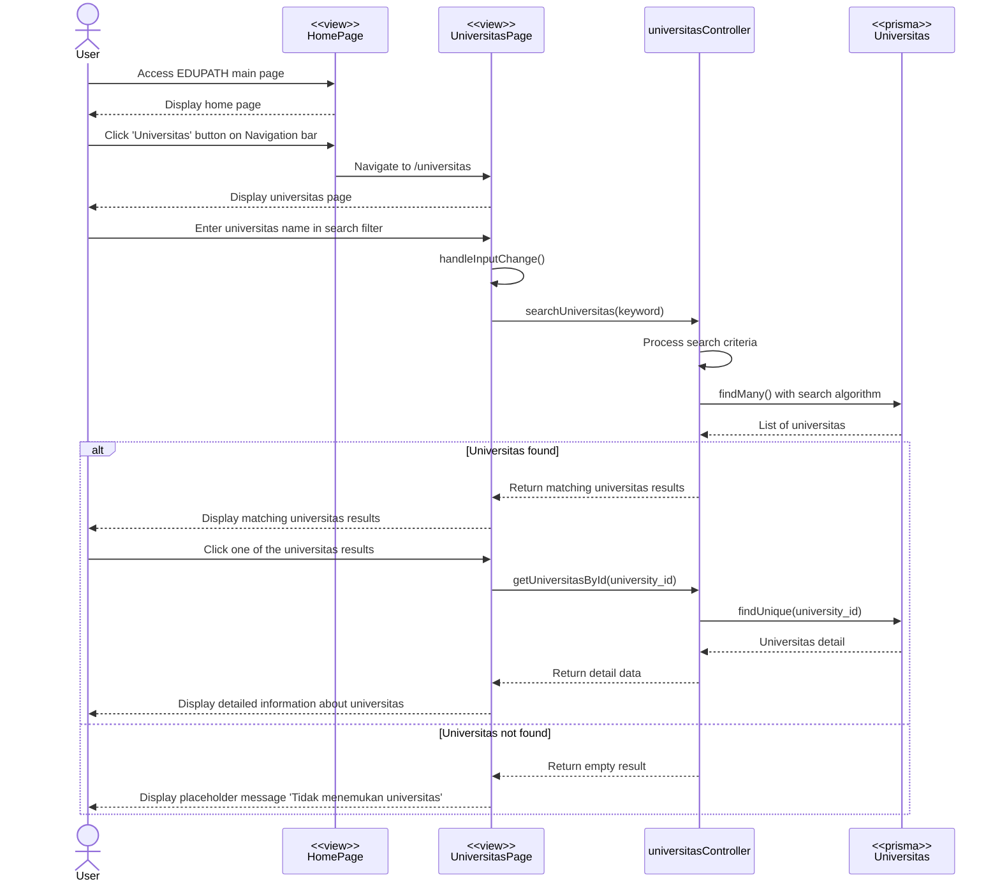

# Universitas Search Code Flow Documentation

## Overview

Dokumentasi ini menjelaskan alur lengkap untuk fitur **Menelusuri Universitas** di aplikasi Edupath, mencakup pencarian universitas, filter, sort, dan menampilkan detail universitas.

---

## 1. Flow Summary

### Main Steps:

1. User membuka halaman Universitas
2. User melakukan pencarian universitas (opsional)
3. User menggunakan filter (Provinsi, Kota, Akreditasi) - opsional
4. Sistem menampilkan hasil pencarian/filter dalam tabel
5. User klik row untuk melihat detail universitas
6. Sistem menampilkan informasi lengkap universitas
7. User dapat menyimpan riwayat pencarian

### Special Features:

- **Smart Search Algorithm**: Pencarian dengan nickname detection dan scoring relevance
- **Search Cache**: Cache hasil pencarian untuk performa optimal
- **Filter Persistence**: Filter state disimpan di localStorage
- **Search History**: Riwayat pencarian 10 terakhir
- **Auto-select Exact Match**: Auto-select universitas jika nama exact match
- **Pagination**: 10 items per page
- **Real-time Filter**: Filter data tanpa reload

---

## 2. Sequence Diagram



---

## 3. Component Structure

### UniversitasPage (`index.tsx`)

**State Management:**

```typescript
// Search states
const [heroQuery, setHeroQuery] = useState("");
const [query, setQuery] = useState("");
const [loading, setLoading] = useState(false);
const [error, setError] = useState("");
const [results, setResults] = useState<UniversitasItem[]>([]);
const [hasSearched, setHasSearched] = useState(false);

// Detail states
const [selectedUniversitas, setSelectedUniversitas] =
  useState<UniversitasDetailType | null>(null);
const [detailLoading, setDetailLoading] = useState(false);
const [detailError, setDetailError] = useState("");

// Filter states
const [selectedProvinsi, setSelectedProvinsi] = useState<string>("Semua");
const [selectedKota, setSelectedKota] = useState<string>("Semua");
const [selectedAkreditasi, setSelectedAkreditasi] = useState<string>("Semua");
const [sortBy, setSortBy] = useState<string>("");
const [sortOrder, setSortOrder] = useState<"asc" | "desc">("asc");

// Pagination
const [currentPage, setCurrentPage] = useState(1);
const itemsPerPage = 10;

// Search history
const [recentSearches, setRecentSearches] = useState<string[]>([]);
```

**Key Methods:**

- `search(q, autoSelectExactMatch)`: Pencarian universitas dengan cache dan scoring
- `fetchUniversitasDetail(universityId)`: Fetch detail universitas untuk ditampilkan
- `fetchUniversitasWithFilters(searchKeyword)`: Unified fetch dengan filter support
- `pushHistory(term)`: Simpan keyword ke search history
- `removeHistoryItem(term)`: Hapus item dari history
- `clearHistory()`: Hapus semua history

**Cache Management:**

```typescript
const searchCacheRef = useRef<Map<string, UniversitasItem[]>>(new Map());
```

### Child Components

**1. SearchBar (`components/SearchBar.tsx`)**

- Hero search input dengan suggestions
- Main search bar dengan autocomplete
- Submit handler untuk trigger search

**2. FilterSortBar (`components/FilterSortBar.tsx`)**

- Filter dropdown: Provinsi, Kota, Akreditasi
- Reset filter button
- Filter state persistence dengan localStorage
- Active filter count badge

**3. SearchHistory (`components/SearchHistory.tsx`)**

- Menampilkan 10 riwayat pencarian terakhir
- Click to search again
- Remove individual item
- Clear all history

---

## 4. Search Algorithm

### Scoring System (Backend - `universitasController.ts`)

```typescript
Prioritas Scoring:
1. Nickname Match (Score: +50-100)
   - Exact nickname: "UI" → "Universitas Indonesia" (+100)
   - Partial nickname: "Binus" → "Bina Nusantara" (+80)
   - Common abbreviations detected

2. Exact Name Match (Score: +10)
   - Full match dalam nama universitas

3. Short Name Match (Score: +8)
   - Match di nama_singkat field

4. Location Match (Score: +3)
   - Match di kota atau provinsi

5. Word Start Match (Score: +5)
   - Word dimulai dengan keyword

6. Contains Match (Score: +2)
   - Word mengandung keyword
```

### Filter Logic

```typescript
1. Pencarian + Filter:
   - Backend: Search dengan scoring (limit 15)
   - Frontend: Filter hasil search (provinsi, kota, akreditasi)

2. Filter Only (tanpa keyword):
   - Backend: findMany() dengan WHERE clause
   - Return: Semua data matching filter

3. No Filter, No Search:
   - Backend: findMany() limit 15
   - Return: Top 15 sorted by QS rank ascending
```

---

## 5. API Specification

### 1. Search Universitas by Name

**Endpoint:** `GET /api/universitas/search`

**Request:**

```http
GET /api/universitas/search?nama=universitas%20indonesia
Authorization: Bearer {token}
```

**Response Success:**

```json
{
  "success": true,
  "data": [
    {
      "university_id": "uuid",
      "nama": "Universitas Indonesia",
      "nama_singkat": "UI",
      "provinsi": "DKI Jakarta",
      "kota": "Depok",
      "akreditasi": "Unggul",
      "email": "humas@ui.ac.id",
      "telepon": "021-7867222",
      "rank_qs": 1,
      "rank_country": 1
    }
  ],
  "message": "Success"
}
```

### 2. Get All Universitas (with filters)

**Endpoint:** `GET /api/universitas`

**Request:**

```http
GET /api/universitas?provinsi=DKI Jakarta&akreditasi=Unggul&limit=15
Authorization: Bearer {token}
```

**Response:** Same structure as search

### 3. Get Universitas Detail

**Endpoint:** `GET /api/universitas/:id`

**Request:**

```http
GET /api/universitas/uuid-university-id
Authorization: Bearer {token}
```

**Response Success:**

```json
{
  "success": true,
  "data": {
    "university_id": "uuid",
    "nama": "Universitas Indonesia",
    "nama_singkat": "UI",
    "kode_pos": "16424",
    "telepon": "021-7867222",
    "fax": "021-7863470",
    "email": "humas@ui.ac.id",
    "alamat": "Jl. Margonda Raya, Pondok Cina, Beji",
    "kota": "Depok",
    "provinsi": "DKI Jakarta",
    "akreditasi": "Unggul",
    "rank_qs": 1,
    "rank_country": 1
  },
  "message": "Success"
}
```

---

## 6. Data Flow & Cache Management

### Search Cache Strategy

```typescript
1. Cache Key:
   - Lowercase trimmed query
   - Contoh: "universitas indonesia" → "universitas indonesia"

2. Cache Storage:
   - searchCacheRef.current (Map)
   - Max entries: Unlimited (cleared on page reload)

3. Cache Hit:
   - Return immediately
   - No API call
   - Fast response

4. Cache Miss:
   - Fetch dari backend
   - Save to cache
   - Return hasil
```

### LocalStorage Usage

```typescript
1. Filter State:
   - Key: "universitasFilterOpen"
   - Value: boolean (showFilters)

2. Search History:
   - Key: "edupath:univSearchHistory"
   - Value: string[] (max 10 items)
   - FIFO: Newest first, remove oldest if > 10
```

---

## 7. Filter & Sort Features

### Filter Options

**Provinsi:**

- Semua (default)
- Dynamic: Extracted from data (DKI Jakarta, Jawa Barat, Jawa Timur, dll.)

**Kota:**

- Semua (default)
- Dynamic: Extracted from data based on selected provinsi

**Akreditasi:**

- Semua (default)
- Unggul
- Baik Sekali
- Baik
- Fixed options

### Filter Persistence

```typescript
useEffect(() => {
  localStorage.setItem("universitasFilterOpen", JSON.stringify(showFilters));
}, [showFilters]);

// On mount
const [showFilters, setShowFilters] = useState(() => {
  const saved = localStorage.getItem("universitasFilterOpen");
  return saved ? JSON.parse(saved) : false;
});
```

### Active Filter Count

```typescript
const activeFilterCount = [
  selectedProvinsi !== "Semua",
  selectedKota !== "Semua",
  selectedAkreditasi !== "Semua",
].filter(Boolean).length;

// Badge display: {activeFilterCount}
```

---

## 8. Pagination

### Implementation

```typescript
const itemsPerPage = 10;
const [currentPage, setCurrentPage] = useState(1);

// Filtered & Sorted results
const filteredResults = useMemo(() => {
  let filtered = [...results];

  // Apply filters
  if (selectedProvinsi !== "Semua") {
    filtered = filtered.filter((u) => u.provinsi === selectedProvinsi);
  }
  if (selectedKota !== "Semua") {
    filtered = filtered.filter((u) => u.kota === selectedKota);
  }
  if (selectedAkreditasi !== "Semua") {
    filtered = filtered.filter((u) => u.akreditasi === selectedAkreditasi);
  }

  // Apply sorting
  if (sortBy) {
    filtered.sort((a, b) => {
      // Sort logic
    });
  }

  return filtered;
}, [
  results,
  selectedProvinsi,
  selectedKota,
  selectedAkreditasi,
  sortBy,
  sortOrder,
]);

// Paginated results
const paginatedResults = useMemo(() => {
  const start = (currentPage - 1) * itemsPerPage;
  return filteredResults.slice(start, start + itemsPerPage);
}, [filteredResults, currentPage]);
```

---

## 9. User Experience Flow

### Happy Path - Search:

```
1. User masuk halaman Universitas ✅
2. Ketik "UI" di search bar ✅
3. Klik "Cari" atau Enter ✅
4. Loading state muncul ✅
5. Cache check (miss) ✅
6. API call ke /api/universitas/search?nama=UI ✅
7. Backend scoring algorithm (Nickname detection) ✅
8. Return top 15 hasil ✅
9. Save to cache ✅
10. Save to search history ✅
11. Tampilkan hasil di tabel ✅
12. Auto-select exact match (jika ada) ✅
13. Detail panel muncul ✅
```

### Happy Path - Filter:

```
1. User klik "Filter" button ✅
2. Filter panel expand ✅
3. Pilih Provinsi "DKI Jakarta" ✅
4. Pilih Akreditasi "Unggul" ✅
5. Save filter ke localStorage ✅
6. Active filter count badge: 2 ✅
7. API call dengan query params ✅
8. Return filtered data ✅
9. Tampilkan hasil ✅
10. User klik row → Detail muncul ✅
```

### Happy Path - History:

```
1. User sudah search "UI", "ITB" ✅
2. Search history muncul di sidebar ✅
3. User klik "UI" ✅
4. Auto-fill search bar ✅
5. Cache hit (data dari cache) ✅
6. Instant result ✅
7. Auto-select exact match ✅
```

### Error Path - No Results:

```
1. User search "zzzzzzzzz" ❌
2. API call success ✅
3. Empty array returned ✅
4. Tampilkan "Tidak ada hasil" message ✅
5. Suggestion: "Coba kata kunci lain" ✅
```

### Error Path - Network Error:

```
1. User search "UI" ✅
2. Network timeout/error ❌
3. Catch error ❌
4. setError("Terjadi kesalahan") ❌
5. Tampilkan error toast ❌
6. Hasil kosong ❌
```

---

## 10. Component Lifecycle

### On Mount

```typescript
useEffect(() => {
  // 1. Load search history dari localStorage
  try {
    const raw = localStorage.getItem(HISTORY_KEY);
    if (raw) setRecentSearches(JSON.parse(raw));
  } catch {}

  // 2. Load filter state dari localStorage (sudah di useState initializer)

  // 3. Check URL params untuk auto-search
  const params = new URLSearchParams(location.search);
  const q = params.get("q");
  if (q) {
    setQuery(q);
    search(q, true);
  }
}, []);
```

### On Filter Change

```typescript
useEffect(() => {
  if (hasSearched) {
    fetchUniversitasWithFilters(query);
  }
}, [selectedProvinsi, selectedAkreditasi]);
```

### On Search

```typescript
1. Check canSearch (min 2 chars)
2. Check cache
3. If cache hit → use cache
4. If cache miss → API call
5. Save to cache
6. Save to history
7. Display results
8. Auto-select exact match (if enabled)
```

---

## 11. Badge & Status Display

### Akreditasi Badge

```typescript
const badgeClass = (value?: string | null) => {
  const v = (value || "").toLowerCase();
  if (v === "unggul" || v === "a") return "bg-green-100 text-green-800";
  if (v === "baik sekali" || v === "b")
    return "bg-secondary-light text-primary-dark";
  if (v === "baik" || v === "c") return "bg-yellow-100 text-yellow-800";
  return "bg-gray-100 text-gray-800";
};
```

### Ranking Badge

```typescript
// QS World University Ranking
if (rank_qs) {
  return `QS Rank: #${rank_qs}`;
}

// National Ranking
if (rank_country) {
  return `Rank Nasional: #${rank_country}`;
}
```

---

## 12. Special Features Detail

### 1. Smart Nickname Detection

**Backend Nickname Matching:**

```typescript
Common Nicknames:
- "UI" → "Universitas Indonesia"
- "ITB" → "Institut Teknologi Bandung"
- "UGM" → "Universitas Gadjah Mada"
- "Binus" → "Bina Nusantara"
- "Unair" → "Universitas Airlangga"
- "ITS" → "Institut Teknologi Sepuluh Nopember"
- "Undip" → "Universitas Diponegoro"
```

**Frontend Auto-select:**

```typescript
if (autoSelectExactMatch && filtered.length > 0) {
  const exact = filtered.find(
    (u) => u.nama.toLowerCase() === q.trim().toLowerCase()
  );
  if (exact) {
    fetchUniversitasDetail(exact.university_id);
  }
}
```

### 2. Abort Previous Requests

```typescript
const controllerRef = useRef<AbortController | null>(null);

// On new search
if (controllerRef.current) controllerRef.current.abort();
const ctrl = new AbortController();
controllerRef.current = ctrl;

// Prevent race conditions
const currentId = ++searchRequestIdRef.current;
if (currentId !== searchRequestIdRef.current) return;
```

### 3. Request ID System

```typescript
const searchRequestIdRef = useRef(0);
const detailRequestIdRef = useRef(0);

// On each request
const currentId = ++searchRequestIdRef.current;

// On response
if (currentId !== searchRequestIdRef.current) return; // Discard stale response
```

---

## 13. Performance Optimizations

### 1. Memoization

```typescript
const canSearch = useMemo(() => query.trim().length >= 2, [query]);

const filteredResults = useMemo(() => {
  // Filter & sort logic
}, [
  results,
  selectedProvinsi,
  selectedKota,
  selectedAkreditasi,
  sortBy,
  sortOrder,
]);

const paginatedResults = useMemo(() => {
  // Pagination logic
}, [filteredResults, currentPage]);
```

### 2. Debounce (if needed)

```typescript
// Optional: Add debounce to search input
const debouncedQuery = useDebounce(query, 300);

useEffect(() => {
  if (debouncedQuery && canSearch) {
    search(debouncedQuery);
  }
}, [debouncedQuery]);
```

### 3. Virtual Scrolling (future enhancement)

```typescript
// For large datasets (> 1000 items)
// Consider react-window or react-virtualized
```

---

## 14. Error Handling

### API Errors

```typescript
try {
  const response = await axios.get(url, config);
  // Success
} catch (e: any) {
  if (e.code === "ERR_CANCELED") return; // Aborted request

  const msg = e?.response?.data?.message || e?.message || "Terjadi kesalahan";
  setError(msg);
  setResults([]);

  // Optional: Show toast
  toast.error(msg);
}
```

### Token Expiry

```typescript
// Handled by axios interceptor (global)
axios.interceptors.response.use(
  (response) => response,
  (error) => {
    if (error.response?.status === 401) {
      TokenManager.logout();
      navigate("/login");
      toast.error("Token expired. Silakan login kembali.");
    }
    return Promise.reject(error);
  }
);
```

---

## 15. Integration Points

### Frontend → Backend:

- `GET /api/universitas/search?nama=:nama`: Search universitas by keyword
- `GET /api/universitas`: Get all universitas with filters
- `GET /api/universitas/:id`: Get universitas detail

### LocalStorage:

- `universitasFilterOpen`: Filter panel state (boolean)
- `edupath:univSearchHistory`: Search history (string[])

### Navigation:

- Query params: `?q=keyword` untuk auto-search on mount
- Deep linking support

---

## 16. Dependencies

### Frontend Libraries:

- `react-router-dom`: Navigation & location
- `axios`: HTTP requests
- `lucide-react`: Icons
- `react-hot-toast`: Toast notifications (optional)

### Backend:

- `prisma`: ORM untuk database
- `express`: HTTP server

---

## 17. Database Schema

### Universitas Table

```prisma
model Universitas {
  university_id     String   @id @default(uuid())
  nama              String
  nama_singkat      String?
  kode_pos          String?
  telepon           String?
  fax               String?
  email             String?
  alamat            String?
  kota              String?
  provinsi          String?
  akreditasi        String?
  rank_qs           Int?
  rank_country      Int?
  prodi_pt          Prodi[]  @relation("UniversitasToProdi")
}
```

---

## Conclusion

Flow ini mengimplementasikan **pencarian universitas** dengan:

- ✅ Smart search algorithm dengan nickname detection
- ✅ Cache management untuk performa optimal
- ✅ Filter & sort dinamis (provinsi, kota, akreditasi)
- ✅ Search history dengan localStorage
- ✅ Pagination untuk navigasi data
- ✅ Detail panel dengan informasi lengkap
- ✅ Error handling yang robust
- ✅ Request cancellation untuk prevent race conditions

Sistem dirancang untuk memberikan user experience yang cepat dan intuitif dalam menemukan universitas yang sesuai dengan dukungan pencarian nickname populer seperti "UI", "ITB", "UGM", dll.
